# Preparing Clothing Mesh

?> This tutorial only provides information about creating a mesh for the main game. Please check "Modding Tutorials" at the sidebar.

## Intro

This tutorial is for 3D Modeling Software called Blender. It is free, Open Source, and easy to learn (maybe).

Also, If you're using different 3D Modeling Software like Autodesk Maya or 3dsMax, I assume you already have a basic understanding of how 3d graphics working and how to make toothbrush.

## Process

### Load Basic Rig

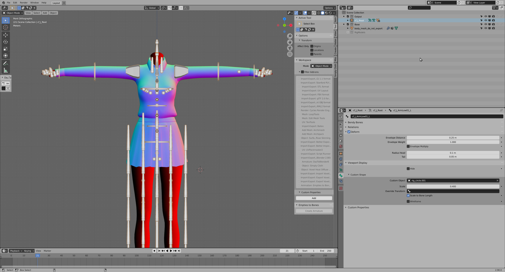

First of all, you need to find the basic rig of the model in order to make any clothing/outfit.

Locate `base_female_clothing.blend` file and open it up with blender.

it already has most of the setup so it's good to start something from this

### Make/Import Mesh

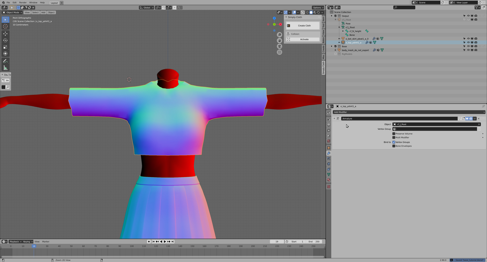

Once you opened the mesh file, import your mesh and create the mesh with the base female mesh.

### Rig the mesh

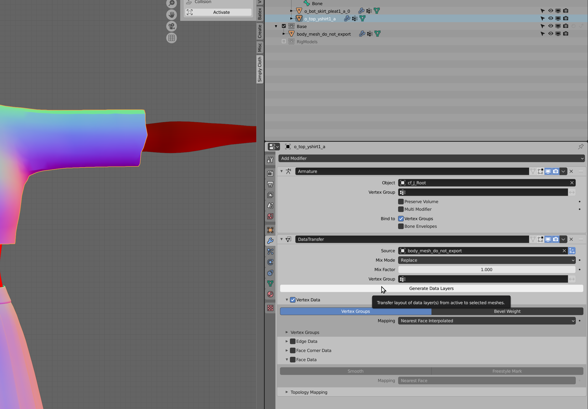

after setting up your mesh around the base body, you need to rig your model.

you can hand paint the rig by the hand but it's good to make computer to the job first.

add `Data Transfer` modifier

set to `base body mesh` and check `vertex data`

click `generate data layer`

and apply the modifier. blender 2.8x has apply button on the menu. 2.9x has small "V" mark has apply button

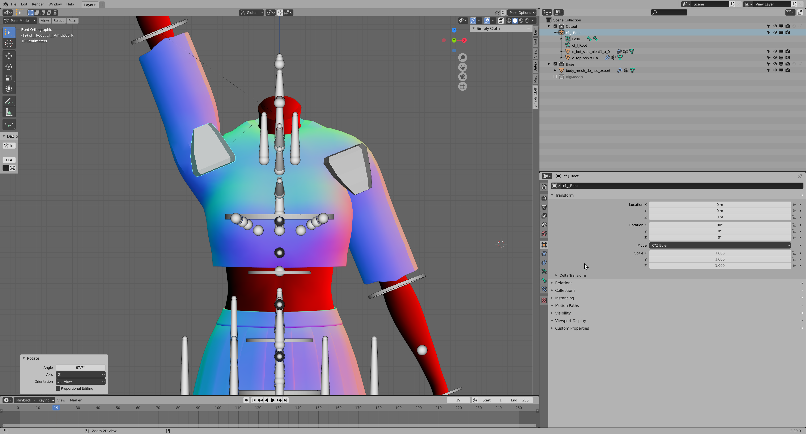

after applying the modifier, check if it's moving as intended.

do not trust data transfer. it's not perfect at all.

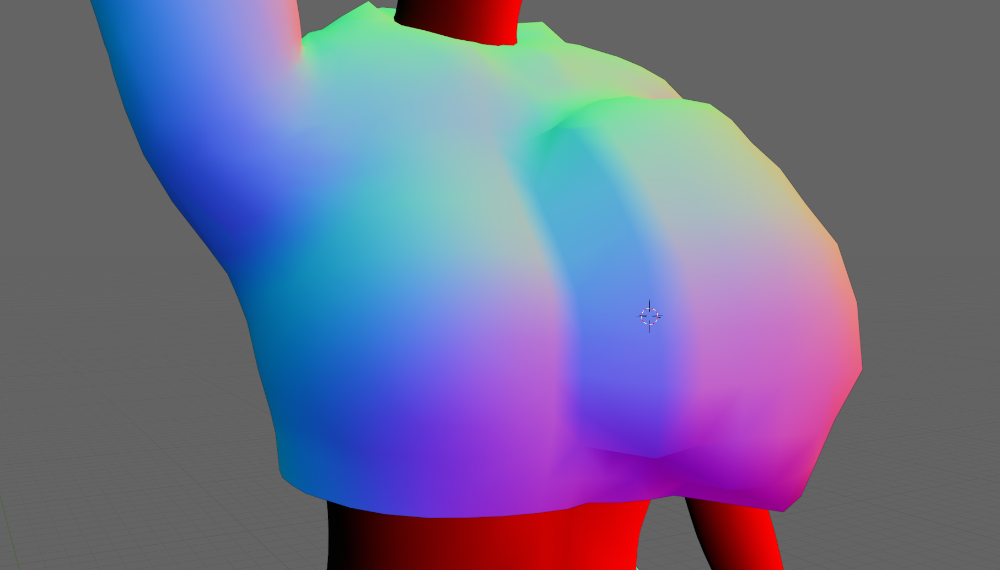

as you can see breast area are messed up, in that case you need to fix it by yourself.

you have few option to fix

1. paint nad blur manually
   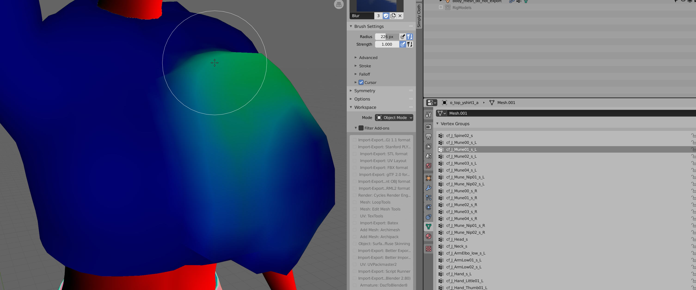
   very painful but accurate
   but if you just blur the edge with blur brush, it's less painful
2. blur all
   
   risky, not work mostly but sometime it works and saves you tons of hours

!> Unity Engine 2018.2.21f, 2018.4.11f only supports 4 weights per vertex. You need to use `Weights > Limit Total` and limit vertex weight count to 4 to prevent data loss

### Organize Mesh

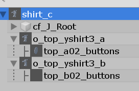

Once you're done making your mesh, you need to organize your mesh to make it work in the game and the modding tool automatically assingn the mesh and save you some time

you need to follow some rules

-   Check you're exporting only one armature
-   Check if the armature name isr `cf_J_Root`
-   Check if the armature's position, scale, angle hasn't changed.
-   You need to make your meshes name complies mesh naming convention

    -   if you're making one of `Top`, `Bottom`, `Inner Top`,`Inner Bottom`, `Set`, `Inner Set` mod

        ```
        cf_J_Root (Armature)
            ↳ n_bot_a (Required for bottom clothing)
                ↳ ... (optional, toggleable additional mesh for bottom clothing)
            ↳ n_bot_b (optional, mesh for half-off state for bottom clothing.)
                ↳ ... (optional, toggleable additional mesh for half-off bottom clothing)
            ↳ n_top_a (Required for top clothing)
                ↳ ... (optional, toggleable additional mesh for top clothing)
            ↳ n_top_b (optional, mesh for half-off state of top clothing.)
                ↳ ... (optional, toggleable additional mesh for half-off top clothing)
        ```

    -   if you're making anything else

        ```
        cf_J_Root (Armature)
            ↳ n_bot_a (Required for bottom clothing)
                ↳ ... (optional, toggleable additional mesh for bottom clothing)
            ↳ n_bot_b (optional, mesh for half-off state for bottom clothing.)
                ↳ ... (optional, toggleable additional mesh for half-off bottom clothing)
            ↳ n_top_a (Required for top clothing)
                ↳ ... (optional, toggleable additional mesh for top clothing)
            ↳ n_top_b (optional, mesh for half-off state of top clothing.)
                ↳ ... (optional, toggleable additional mesh for half-off top clothing)
        ```

-   check all of mesh under `cf_J_Root` Armature has `Armature Modifier`

### Export Mesh


When you're finished with adjusting your mesh, you need to export your mesh to unity editor to use the mesh in the game.

Since illusion does not like default unity export, you need to do few setup before exporting your model to the editor.

enable those options

-   **Bake Anim** → OFF
-   **Export Types** → {Empty, Armature, Mesh, Other}
-   **Scale** → 1
-   **Apply Scalings** → FBX ALL
-   **Forward** → -Z Forward
-   **Up** → Y Up
-   **Apply Unit** → ON
-   **Apply Transform** → ON
-   **Bake Animation** → OFF

if you know how to import / make your own export preset, just copy and paste this option.

```python
import bpy
op = bpy.context.active_operator

op.filepath = 'TARGET PATH NAME'
op.use_selection = True
op.use_active_collection = False
op.global_scale = 1.0
op.apply_unit_scale = True
op.apply_scale_options = 'FBX_SCALE_ALL'
op.bake_space_transform = True
op.object_types = {'MESH', 'ARMATURE', 'OTHER', 'EMPTY'}
op.use_mesh_modifiers = True
op.use_mesh_modifiers_render = True
op.mesh_smooth_type = 'OFF'
op.use_subsurf = False
op.use_mesh_edges = False
op.use_tspace = False
op.use_custom_props = False
op.add_leaf_bones = False
op.primary_bone_axis = 'Y'
op.secondary_bone_axis = 'X'
op.use_armature_deform_only = False
op.armature_nodetype = 'NULL'
op.bake_anim = False
op.bake_anim_use_all_bones = True
op.bake_anim_use_nla_strips = True
op.bake_anim_use_all_actions = True
op.bake_anim_force_startend_keying = True
op.bake_anim_step = 1.0
op.bake_anim_simplify_factor = 1.0
op.path_mode = 'AUTO'
op.embed_textures = False
op.batch_mode = 'OFF'
op.use_batch_own_dir = True
op.axis_forward = '-Z'
op.axis_up = 'Y'
```

### Preview your model in Unity Editor

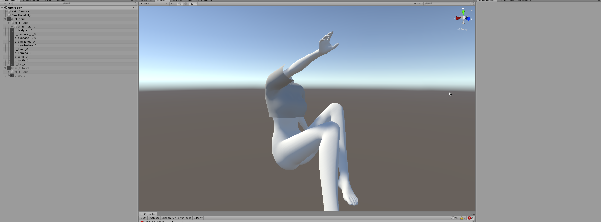

Once you've made the model and imported it, you can test if your model works in the unity editor before putting the model in the main game.

If the model is not working in the Unity Editor, it will not work in the main game either. So, checking the model is working in the engine is an important task you should not miss.

Remember that you're only testing if the mesh works correctly with the game's base body mesh.

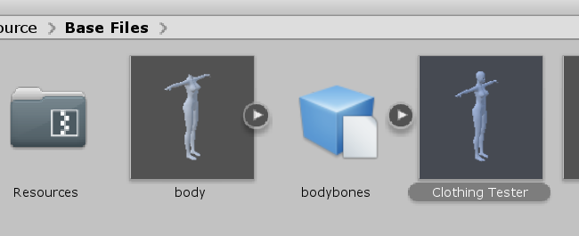

Locate `Clothing Tester` inside the `Base Files` folder and drag it to the scene to test your mesh.

After putting the prefab to the scene, click the `Clothing Tester` and find `Clothing Bind Helper` in the inspector and drag your clothing model to `Meshes To Test`.

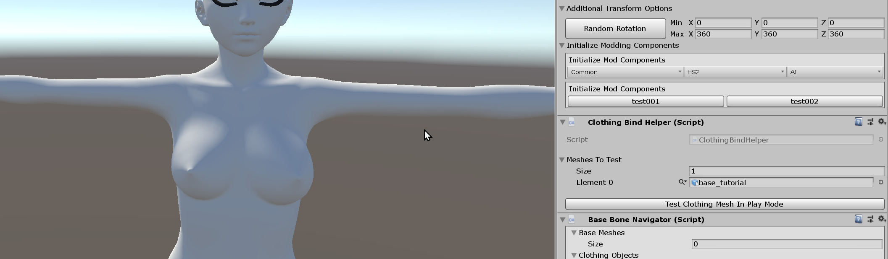

If you can see your model inside of the `Meshes To Test` list, then you're good to go. Remember that you can put more than one model to test multiple combinations of models at once to see how they will work in the game.

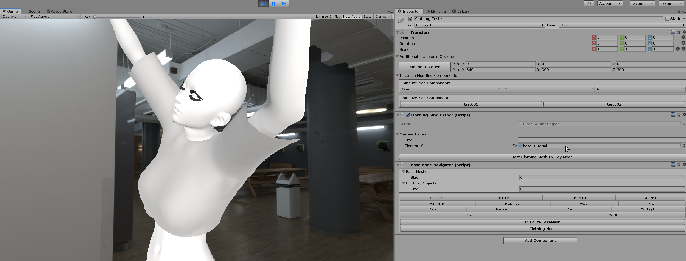

When you go Play Mode and press "Test Clothing Mesh in Play Mode", you can see the meshes following the character with the animation.

If the model is not following the bones, then you can check the Trouble Shooting section below.

## Trouble Shooting

!> If you can't find the issue here, then check [**Trouble Shooting**](tutorials/trouble-shooting.md) page.

### Mesh is not following the character

Check if you've correctly exported the model from the 3D Modeling Software.

Especially for blender users, include the armature, mesh, and armature modifier to an exported FBX file, or it likely won't work.

If you failed to export the model once, the unity engine would think that your model is not the model with the bones.

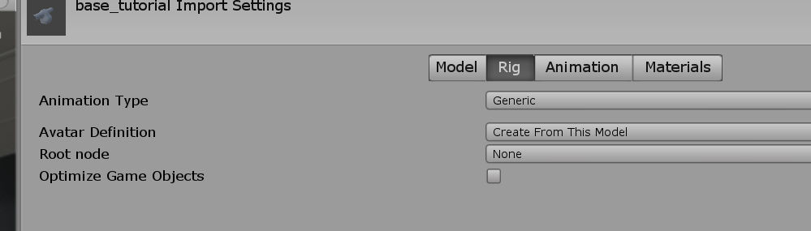

In that case, you need to change the rig of the model to "Animation Type: Generic" to get your mesh working again.

### I can't see my Mesh / Mesh gets too big when I test it

Check if the model's scale is `1,1,1`. Otherwise, the mode will re-scaled to the base model's scale.

### It works well in the Blender but not in the Unity Editor.

As i stated at the top of the document, only four weights per vertices are allowed by unity default. There is no way to lift this limitation, sorry.
