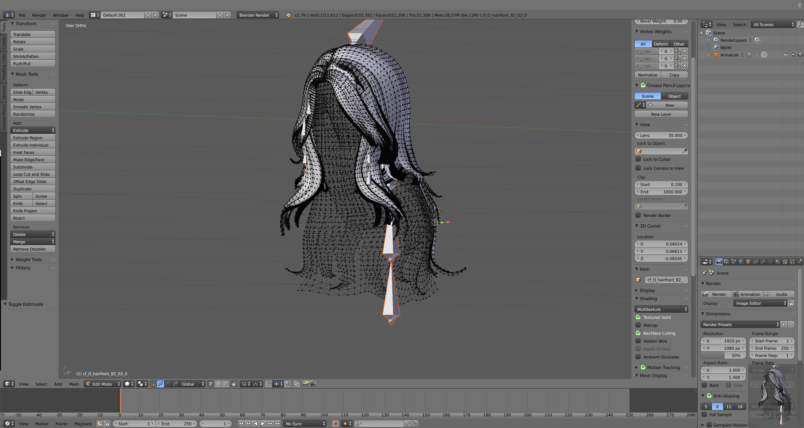

# Preparing Hair Mesh

### Prepare Assets



#### Prepared Asset - Rigged Hair


#### Prepared Asset - Properly setup UV for hooh's Hair Texture. (Optional)

After then, prepare some nice mesh to put on. You can use any 3d editing tool. The minimum requirement for the hair object is a bone and a mesh.

If you want to make your hair move then you need to add more then 2 bones. also, the more bone is the more smooth it feels. 

I'm not going to explain the basic of 3D modeling here. you can go Youtube to search some nice infromations about how to use 3D software. You'll need to learn following things: basic mesh editing, culling, basic setup, vertex weighting, rigging.

[!] WARNING [!]

Currently it's in alpha, you're forced to use or make dummy textures to fit requirements to build hair mod.

Hair mod requires 5 essential textures.

1. diffuse

   still figuring out how it's working but Green Channel is Depth and Red Channel is Diffuse and Alpha Channel is Alpha Cutout. (or dither.)

2. normal

   it's a normal map. [just use this flat bumpmap texture if you don't know what to do.](https://docs.unity3d.com/uploads/Main/BumpMapFlatColour.png)

3. noise

   detail normal map that illusion is using to make it looks like some real hairs. [just use this flat bumpmap texture if you don't know what to do.](https://docs.unity3d.com/uploads/Main/BumpMapFlatColour.png)

4. colormask

   colormask for hairs. Red is Main Color, Green is Top Color Blur is Bottom Color. Just make red texture if you don't know what to do.

5. ao

   Ambient Occlusion texture for hair. Just make white texture if you don't know what to do.

Do NOT rename texture's name (you can rename extensions) or it will fail to build!

#### Properly name bones

Please follow the bone naming convention to make tool detect target bones and setup dynamic bones and other stuffs automatically. 

Root bone should be `***_top`, branch bones should be `***_s`.

It will looks like this

```
hair_top
   └ back_s
      └ ... child bones
   └ front_s
      └ ... child bones
   └ side_s
      └ ... child bones
```

### 