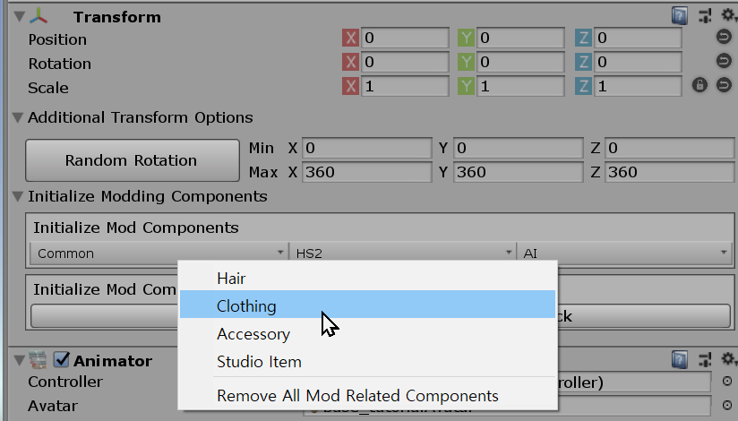

# Creating Skinned Accessory

## Related Documents

This page only contains how to put clothing-like accessories into the game with adjustable attributes.

If you need more basic information like setup folders or preparing hair assets, please visit the pages below before continuing to read this document:

-   [Getting Started with the hooh's Modding Tool](getting_started.md)

-   [Setting up Folder](tutorials/gearing-up.md)

-   [Creating Clothing Mesh](prepping/clothing-mesh.md)

## Steps

?> This tutorial only provides information about putting existing mesh to the main game. Please check [Creating Clothing Mesh](prepping/clothing-mesh.md) Document if you want to know how to make a clothing model.

### Initialize Component



When you've done putting your mesh to the scene, click it, navigate the right panel, and click the `Initialize Modding Components > Common > Accessory` button.

Then the Modding Tool will automatically find the references in your model and initialize everything to make your model work in the game.

### Creating Mod XML

```xml
<packer>
    <guid>example.clothing.text</guid> <!-- please change guid! -->
    <name>Example CLothing</name>
    <version>1.0.0</version>
    <author>My Name</author>
    <description>My first outfit mod</description>
    <bundles>
        <folder auto-path="prefabs" from="prefabs" filter=".*?\.(psd|png|tif|prefab)"/>
        <folder auto-path="thumbs" from="thumbs" filter=".*?\.(psd|png|tif)"/>
    </bundles>
    <build>
        <!-- If you put your clothing inside of regular top category, use example below-->
        <list type="ftop">
            <item
                    kind="0" possess="1" name="My First Outfit" state="0"
                    coordinate="1" mesh-a="MyPrefab" en-us="0"
                    no-bra="0" bodymask-bundle="0" bodymask-tex="0"
                     bramask-bundle="0" bramask-tex="0" breakmask-tex="0"
                    innermask-tb-bundle="0" innermask-tb-tex="0"
                    innermask-b-bundle="0" innermask-b-tex="0"
                    panstmask-bundle="0" panstmask-tex="0"
                     bodymask-b-bundle="0" bodymask-b-tex="0"
                    tex-main="MainTextureForMyOutfit"
                     tex-mask="ColorMaskTextureForMyOutfit" tex-main2="0" tex-mask2="0"
                    tex-main3="0" tex-mask3="0" hide-bottom="0" thumb="Thumbnail"
            />
        </list>
        <!-- If you put your clothing inside of inner top category, use example below-->
		<list type="fintop">
            <!-- if you set coordinate to "1", it becomes top/bottom set. -->
			<item
				kind="0" possess="2" name="[hooh] My Prefab" mesh-a="MyPrefab" state="0"
				coordinate="0" overbra-type="0" bodymask-tex="0"
				tex-main="MainTextureForMyOutfit" tex-mask="ColorMaskTextureForMyOutfit"
				hide-bottom="0" thumb="Thumbnail"
			/>
		</list>
    </build>
</packer>
```

!> The GUID, bundle name, build name should be **unique**, and you can only refer files in Asset Bundles in the Mod XML File.

You can check the comment inside of the XML Code section above to see what to do.

For more detailed information, you can check those documents for reference.

-   [XML File Structure](technical/xml-file.md) for general Mod File Information
-   [Auto-Path Lists](technical/autopath-list.md) for `<folder auto-path>`
-   [XML List Types](technical/category-list.md) for `<list type>` and `<item>`

### Build Mod


Drag and drop your custom mod XML file into the mod builder's target window.

After setting the build target, check if the output path is where you desire to put your custom zipmod archive.

If everything is okay, validate your XML file if you didn't make any mistake inside the XML file.

Unless a mod packer cannot find an asset or has some issue while resolving the Asset Bundle's path, it says nothing.

Then you're good to go. Press the big green button and to build the mod.

It depends on your mod size, but it will play a nice sound to notify the packing is done after a few seconds or minutes.

### Trouble Shooting

!> If you can't find the issue here, then check [**Trouble Shooting**](tutorials/trouble-shooting.md) page.
