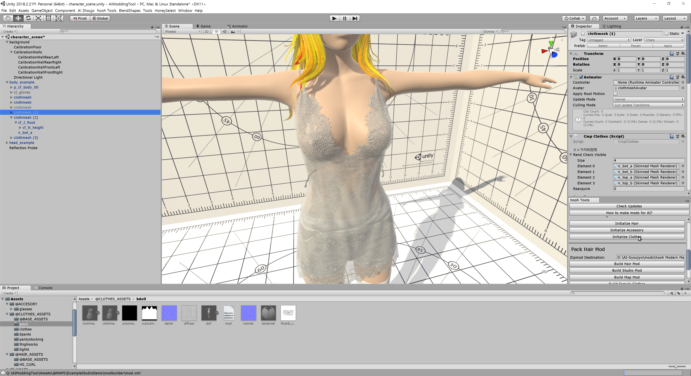

# How to make Top Clothes

## Related Document

This page only contains how to put hair models into the game with adjustable attributes.

If you need more basic information like setup folders or preparing hair assets, please visit the pages below before continuing to read this document:

-   [Getting Started with the hooh's Modding Tool](getting_started.md)

-   [Setting up Folder](tutorials/gearing-up.md)

## Steps

### Putting Assets

!> `.OBJ` format does not supports FK studio items. Make sure that you're importing `.FBX` format 3D Mesh Files to make FK works on the model.


Import or make the 3D asset and drag and drop into `assets` folder in your mod folder

It would be best to import all textures, models, and all other required assets to the Unity Editor.

### Open Workspace



Open `character_scene.unity` in Modding Tool (it's opened by default.)

### Setup GameObject

Drag your clothemesh.fbx to body_example and see if the mesh fits.

### Initialize Component


Once you put your mod on character then go to transform and press `Initialize Modding Components > Common > Clothing`

### Making your clothing colorable

If you need to want to make color working

for detailed info refer [**ILLUSION Shader**](technical/illusion-shader.md) for detailed information

### Register Prefab

Drag your gameobject to Project folder.

### Make mod.xml

```xml
<packer>
    <guid>example.clothing.text</guid> <!-- please change guid! -->
    <name>Example CLothing</name>
    <version>1.0.0</version>
    <author>My Name</author>
    <description>My first outfit mod</description>
    <bundles>
        <folder auto-path="prefabs" from="tex" filter=".*?\.(psd|png|tif|prefab)"/>
        <folder auto-path="thumbs" from="thumbs" filter=".*?\.(psd|png|tif)"/>
    </bundles>
    <build>
        <list type="ftop">
            <item
                    kind="0" possess="1" name="My First Outfit" state="0"
                    coordinate="1" mesh-a="mesh" en-us="0"
                    no-bra="0" bodymask-bundle="0" bodymask-tex="0"
                     bramask-bundle="0" bramask-tex="0" breakmask-tex="0"
                    innermask-tb-bundle="0" innermask-tb-tex="0"
                    innermask-b-bundle="0" innermask-b-tex="0"
                    panstmask-bundle="0" panstmask-tex="0"
                     bodymask-b-bundle="0" bodymask-b-tex="0"
                    tex-main="lopo_cf_m_top_onepiece1_AlbedoTransparency"
                     tex-mask="colormask" tex-main2="0" tex-mask2="0"
                    tex-main3="0" tex-mask3="0" hide-bottom="0" thumb="thumb_mesh"
            />
        </list>
    </build>
</packer>
```

!> The GUID, bundle name, build name should be **unique**, and you can only refer files in Asset Bundles in the Mod XML File.

You can check the comment inside of the XML Code section above to see what to do.

For more detailed information, you can check those documents for reference.

-   [XML File Structure](technical/xml-file.md) for general Mod File Information
-   [Auto-Path Lists](technical/autopath-list.md) for `<folder auto-path>`
-   [XML List Types](technical/category-list.md) for `<list type>` and `<item>`

### Build Mod


Drag and drop your custom mod XML file into the mod builder's target window.

After setting the build target, check if the output path is where you desire to put your custom zipmod archive.

If everything is okay, validate your XML file if you didn't make any mistake inside the XML file.

Unless a mod packer cannot find an asset or has some issue while resolving the Asset Bundle's path, it says nothing.

Then you're good to go. Press the big green button and to build the mod.

It depends on your mod size, but it will play a nice sound to notify the packing is done after a few seconds or minutes.

### Test In-Game

Test your clothes working in-game.

I recommend 2155x's makersearch to save your time

### Trouble Shooting

!> If you can't find the issue in here then check [**Trouble Shooting**](tutorials/trouble-shooting.md) page.
