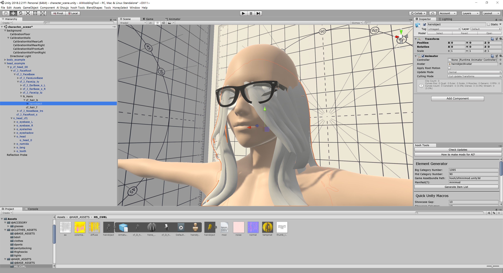
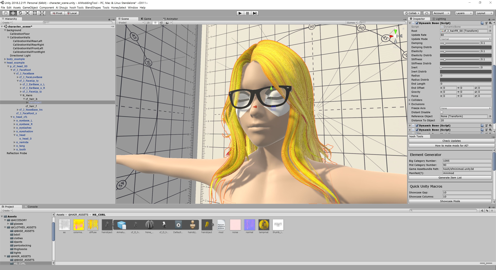
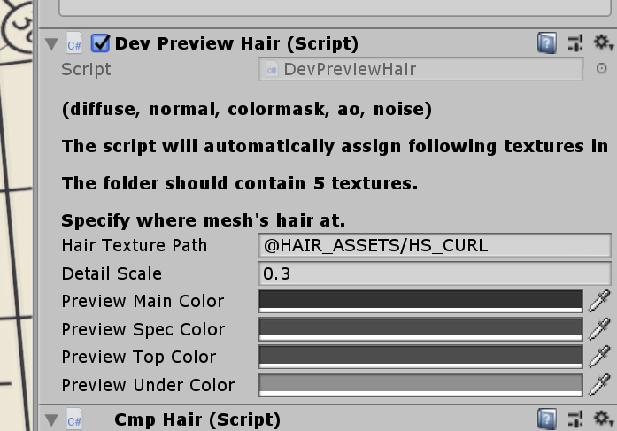

# How to make hairs

## Related Document

This page only contains how to put hair models into the game with adjustable attributes.

If you need more basic information like setup folders or preparing hair assets, please visit the pages below before continuing to read this document:

-   [Getting Started with the hooh's Modding Tool](getting_started.md)
-   [Setting up Folder](tutorials/gearing-up.md)
-   [Preparing Hair Assets](prepping/hair-mesh.md)

## Steps

### Prepare Scenes


Load Example Scene from `character_scene.unity` and navigate to N_Hairs of head_example.

put your mesh on that N_Hairs.



It will looks like this. Apply material first. I'll make temporal material with then name 'tempmat' and apply the material to the hair mesh.
Remember this name because we're going to include this in `mod.xml`.


The material should include all of textures you're going to use. Setup your temporal material like this


but do not convert noise.png because it's already a normal map.

After setting up material, you need to adjust your hair. Adjust your hair with Unity Editor or 3D Tool to just make it fit right on the head mesh.


### Add Behavior to your Hair

If you have long hair, it's expected be affected by external force or gravity. there is a lot of way to do it, but I'm using ILLUSION's way - DynamicBones.

DynamicBone is a Unity Asset can be purchased in [here](https://assetstore.unity.com/packages/tools/animation/dynamic-bone-16743). _You can do other things_ but I suggest you to purchase the plugin from the asset store for the most stable experience.

Since it's really complicated I suggest you to experiment it with Play Mode first. You can set values in editor and see how they're moving in Play Mode by moving around your root head object.

I suggest you to go some VRChat Dynamic Bone tweaking Tutorial. They have more information than me. I'll more focus on how to add new hairs on the game.



Add your DynamicBone and assign DynamicBone's root to your hair bones. If you don't get how to make it so, check the examples comes with modding tool.


Check if your DynamicBone is working or not in **PLAY MODE**. <u>You cannot check whether it's working or not in Edit Mode</u>

### Initialize Hair with Modding Tool

Click your hair mesh and click Initialize Hair.

It will setup everything hair related components automatically. Dynamic bones are also automatically added to the Gameobject. Be sure your bones are following name convention in order to automatically add everything.

```
Correct bone name and structure.
hair_top
   └ back_s
      └ ... child bones
   └ front_s
      └ ... child bones
   └ side_s
      └ ... child bones
```


If you can see things like this, it's working so you don't have to worry about it. just make sure of few things like:

1. If RendCheckVisible and RendHair has more than 0 Size?
2. Is your hair object is in layer 'Chara'?

### Register mod.xml

Make your mod.xml. example can be found in [here](https://github.com/hooh-hooah/ModdingTool/blob/master/Assets/%40HAIR_ASSETS/HS_CURL/mod.xml).

Check following list or it will fail to build:

1. Check if every texture's extension is correct.
2. Check if you've included hair material in mod.xml

### Preview your hair before export

Add DevPreviewHair Component to your hair mesh.



It will allow you to see how it will looks like in the game in **Play Mode**. It will reduce time and effort of checking your mod by launching the game.


Just make sure everything is there and path is correct.


You can test how texture will affect the shading and what you can do by changing the textures and sliders.

### Build Mod


Specify Zipmod Destination and click build hairs.

Remember, you need to install Bandizip in C: Drive at this moment to pack zipmods. I will change this later.

## Steps


1. Select any game object to apply hair material.
2. Add Component "DevPreviewHair"
3. Go to folder where you stored your hair textures.
4. Press Assign Textures or Drag and Drop textures manually to Textures Area.
   Assign Textures will seek for:
    - Any Texture that contains word "color" in the name but does not have word "mask" in the name
    - Any Texture that has "normal" in the name.
    - Any Texture that has "ao", "ambient", "occlusion" in the name.
    - Any Texture that has "noise" in the name.
    - Any Texture that has "colormask" in the name.
5. Check if all textures are assigned.
6. Press Initialize

### Build Mod


Drag and drop your custom mod XML file into the mod builder's target window.

After setting the build target, check if the output path is where you desire to put your custom zipmod archive.

If everything is okay, validate your XML file if you didn't make any mistake inside the XML file.

Unless a mod packer cannot find an asset or has some issue while resolving the Asset Bundle's path, it says nothing.

Then you're good to go. Press the big green button and to build the mod.

It depends on your mod size, but it will play a nice sound to notify the packing is done after a few seconds or minutes.

## Caution

1. You can't include assetbundle-loaded materials into assetbundle buildlist.
2. All of preview is temporary to the session. Restarting unity might break the texture.

### Trouble Shooting

!> If you can't find the issue in here then check [**Trouble Shooting**](tutorials/trouble-shooting.md) page.
