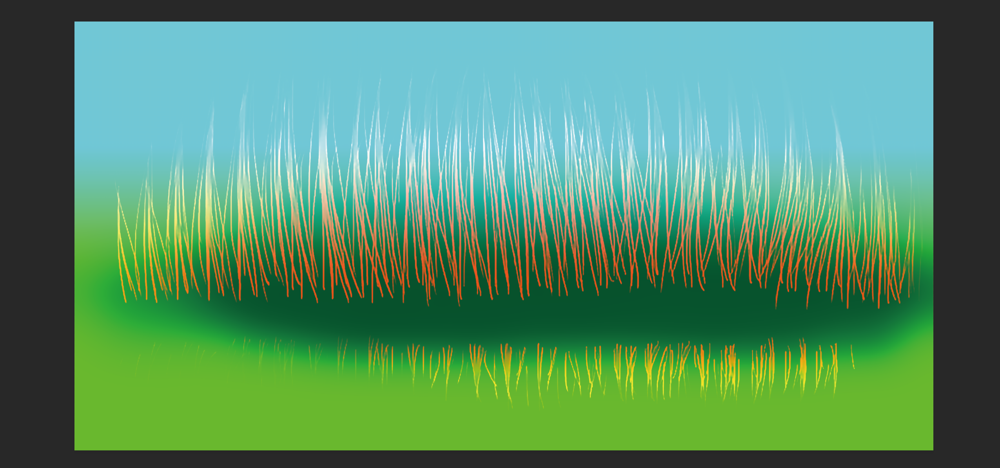
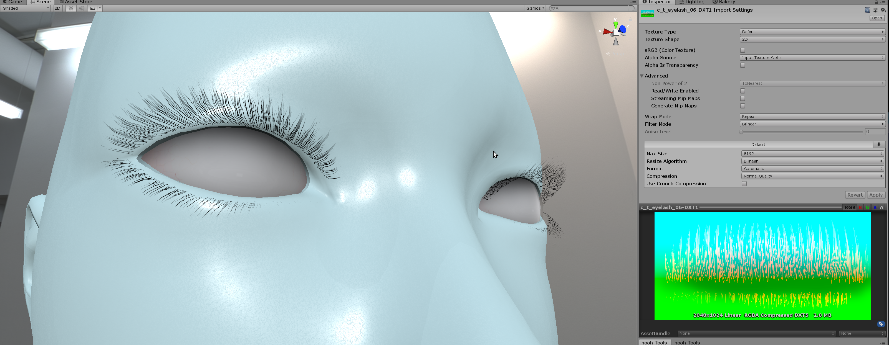
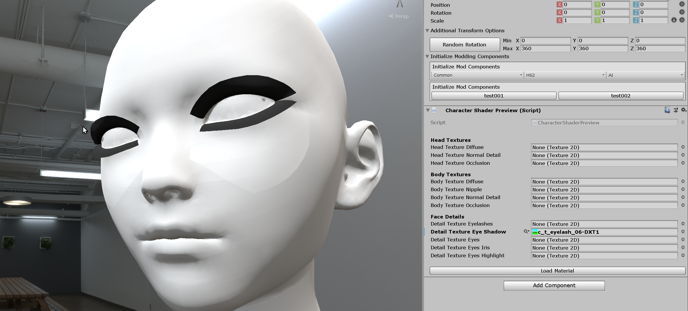

# Creating Custom Eyelashes

## Related Documents

This page only contains how to put hair models into the game with adjustable attributes.

If you need more basic information like setup folders or preparing hair assets, please visit the pages below before continuing to read this Document:

-   [Getting Started with the hooh's Modding Tool](getting_started.md)
-   [Setting up Folder](tutorials/gearing-up.md)

## Steps

### Creating Textrure



ILLUSION's shaders are using custom textures for the face textures. So, You need to know each color channel of the texture purpose to create custom eyelashes.

| Channel | Purpose                    |
| ------- | -------------------------- |
| Red     | Opacity eyelashes (Normal) |
| Green   | Glossiness (Multiply)      |
| Blue    | Colormask (Multiply)       |

Don't forget to set your image to 16-bit Color Depth. Otherwise, you're going to get a lot of blocky artifacts to your custom Texture.

### Importing Texture



Save the Textures you've made to your custom Mod Folder. You can see how to set up the folder in the [Setting up Folder](tutorials/gearing-up.md) Document.

In this case, I'm going to save all of my textures into the `textures` folder.

When you click the texture file, the inspector will change to "Import Option".

Change a few options in the inspector menu.

-   **Alpha Source** → Input Texture Alpha
-   **Alpha is Transparency** → NO
-   **Streaming Mip Map** → NO
-   **Generate Mip Maps**
    -   Disabling Mip Maps: Can get the crisp Texture. But the Texture might look jagged in low resolution or far distance.
    -   Enabling Map Maps: Can get consistent quality any distance. But the Texture might look blurry.
-   **Wrap Mode** → Clamp

!> I recommend not to touch any compression options if you don't know what you're doing. Some compression option will make the Texture lose its transparency! You can check [the Unity Engine's Document about texture compression](https://docs.unity3d.com/Manual/class-TextureImporterOverride.html) to see what's going on.

### Testing Texture



Go to the `Base Files` folder and put `Texture Tester` prefab to the scene.

Assign Textures that you want to test in the component. You can assign textures by simple drag and drop the texture to the slot.

### Creating Mod XML File

```xml
<packer>
    <guid>example.custom.eyelashes</guid>
    <name>Custom Eyelashes</name>
    <version>1.0.0</version>
    <author>Your Name</author>
    <description>My First Eyelashes Pack</description>
    <bundles>
        <!-- referencing "textures" folder. path is relative to the folder where mod.xml is present -->
        <each from="textures" auto-path="textures" filter=".+\.(png|tga|tif|psd)"/>
        <folder from="thumbs" auto-path="thumbs" filter=".+\.(png|tga|tif|psd)"/>
    </bundles>
    <build>
        <!-- CUstom Eyelashes are for all genders. -->
        <list type="seyelash">
            <item name="My Custom EyeLashes" tex-a="my_texture_name" thumb="my_thumbnail_name"/>
        </list>
    </build>
</packer>
```

In this case, Each custom eyelashes only requires one file per an item in the list. I will use the `<each>` bundle operator to create each fil as an asset bundle.

!> The GUID, bundle name, build name should be **unique**, and you can only refer files in Asset Bundles in the Mod XML File.

You can check the comment inside of the XML Code section above to see what to do.

For more detailed information, you can check those documents for reference.

-   [XML File Structure](technical/xml-file.md) for general Mod File Information
-   [Auto-Path Lists](technical/autopath-list.md) for `<folder auto-path>`
-   [XML List Types](technical/category-list.md) for `<list type>` and `<item>`

### Building Mod


Drag and drop your custom mod XML file into the mod builder's target window.

After setting the build target, check if the output path is where you desire to put your custom zipmod archive.

If everything is okay, validate your XML file if you didn't make any mistake inside the XML file.

Unless a mod packer cannot find an asset or has some issue while resolving the Asset Bundle's path, it says nothing.

Then you're good to go. Press the big green button and to build the mod.

It depends on your mod size, but it will play a nice sound to notify the packing is done after a few seconds or minutes.

## Trouble Shooting

!> If you can't find the issue here, then check [**Trouble Shooting**](tutorials/trouble-shooting.md) page.

### Uh.. My Tatto is repeating all over the skin/face!

The Texture's import option is wrong. All of the tattoo, chests, and other paint parts must be in `Clamp` Wrap Mode.

You can set the **Wrap Mode** by clicking your Texture and search around the middle of the menu.
