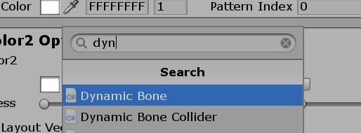
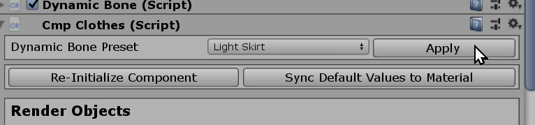

# Creating Custom Skirts

## Related Documents

This page only contains how to put hair models into the game with adjustable attributes.

If you need more basic information like setup folders or preparing hair assets, please visit the pages below before continuing to read this document:

-   [Getting Started with the hooh's Modding Tool](getting_started.md)
-   [Setting up Folder](tutorials/gearing-up.md)

## Steps

### Open Workspace


Open `character_scene.unity` in Modding Tool (it's opened by default.)

### Putting Assets

!> `.OBJ` format does not supports FK studio items. Make sure that you're importing `.FBX` format 3D Mesh Files to make FK works on the model.


Import or make the 3D asset and drag and drop into `assets` folder in your mod folder

It would be best to import all textures, models, and all other required assets to the Unity Editor.

Once you put all assets to the folder, create related materials for the model.


After setting up all materials, Put the model on the scene, and rig up the material.


You can also assign materials in the model import menu that you can see when you click the model.

### Initialize Component


Once you put your mod on character then go to transform and press `Initialize Modding Components > Common > Clothing`

### Setting Colormask

AI/HS2 utilizes custom colormask texture to color the clothing's texture with various colors.

If you don't want to struggle with setting up colormask, you can draw a black dot and save it as png and call it colormask.

You can check [**ILLUSION Shader**](technical/illusion-shader.md?id=texturepattern-rendering-clothing) document for more detailed information about colormask

### Setting Up Dynamic Bones

!> Dynamic Bone is a paid asset. The only reason it's in the modding tool is to make users create dynamic clothing for the game. Do not use this asset to other projects.

#### Manual



#### Automatic Preset



### Check Dynamic Bones

go to play mode and check dynamic bones are working

if components are working well, go to next step

### Register Prefab


After marking all of the items as `Studio Item`, it's time to register them as `prefab`.

Drag and drop to the project folder. Make sure that you're in the `prefabs` folder in your mod folder directory.

Unfortunately, you can't register multiple items as prefabs by drag and drop to the project folder.

But, there is a solution. Go to hooh's modding tool window and find `Create Prefab from Selected Objects`.


The button is in the `Quick Unity Macros` fold groups in the window. You can easily find the button once you open the foldout menu.

This button will register multiple selected items as `prefab` to the current folder.

### Creating Mod XML

```xml
<packer>
    <guid>example.clothing.text</guid> <!-- please change guid! -->
    <name>Example CLothing</name>
    <version>1.0.0</version>
    <author>My Name</author>
    <description>My first outfit mod</description>
    <bundles>
        <folder auto-path="prefabs" from="tex" filter=".*?\.(psd|png|tif|prefab)"/>
        <folder auto-path="thumbs" from="thumbs" filter=".*?\.(psd|png|tif)"/>
    </bundles>
    <build>
        <!-- If you put your clothing inside of regular bottom category, use example below-->
        <list type="fbottom">
            <item
				kind="0" possess="1" name="[hooh] Cardigan" en_us="0" state="0" coordinate="0" mesh-a="cardigan" no-bra="0"
				bodymask-bundle="chara/00/ft_bodymask_00.unity3d" bodymask-tex="cf_bodymask_cutej"
				bramask-bundle="chara/00/ft_bramask_00.unity3d" bramask-tex="cf_bramask_01"
				breakmask-tex="0" innermask-tb-bundle="0" innermask-tb-tex="0" innermask-b-bundle="0" innermask-b-tex="0"
				panstmask-bundle="0" panstmask-tex="0" bodymask-b-bundle="0" bodymask-b-tex="0"
				tex-main="diffuse" tex-mask="colormask" tex-main2="0" tex-mask2="0" tex-main3="0" tex-mask3="0" hide-bottom="0"
				thumb="thumb_image2"
            />
        </list>
        <!-- If you put your clothing inside of inner bottom category, use example below-->
		<list type="finbottom">
            <!-- if you set coordinate to "1", it becomes top/bottom set. -->
			<item
    			kind="0" possess="1" name="@@EXAMPLE PANTYSTOCKING" en_us="0"
				mesh-manifest="abdata" mesh-bundle="example/pantystocking.unity3d" mesh-a="clothmesh" state="1"
            	tex-main="diffuse" tex-mask="colormask" tex-main2="0" tex-mask2="0" hide-bottom="0"
				thumb-bundle="example/pantystocking_thumb.unity3d" thumb="thumb_image"
			/>
		</list>
    </build>
</packer>
```

!> The GUID, bundle name, build name should be **unique**, and you can only refer files in Asset Bundles in the Mod XML File.

You can check the comment inside of the XML Code section above to see what to do.

For more detailed information, you can check those documents for reference.

-   [XML File Structure](technical/xml-file.md) for general Mod File Information
-   [Auto-Path Lists](technical/autopath-list.md) for `<folder auto-path>`
-   [XML List Types](technical/category-list.md) for `<list type>` and `<item>`

### Build Mod


Drag and drop your custom mod XML file into the mod builder's target window.

After setting the build target, check if the output path is where you desire to put your custom zipmod archive.

If everything is okay, validate your XML file if you didn't make any mistake inside the XML file.

Unless a mod packer cannot find an asset or has some issue while resolving the Asset Bundle's path, it says nothing.

Then you're good to go. Press the big green button and to build the mod.

It depends on your mod size, but it will play a nice sound to notify the packing is done after a few seconds or minutes.

### Trouble Shooting

!> If you can't find the issue here, then check [**Trouble Shooting**](tutorials/trouble-shooting.md) page.
