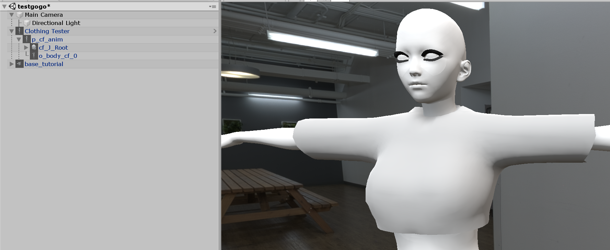
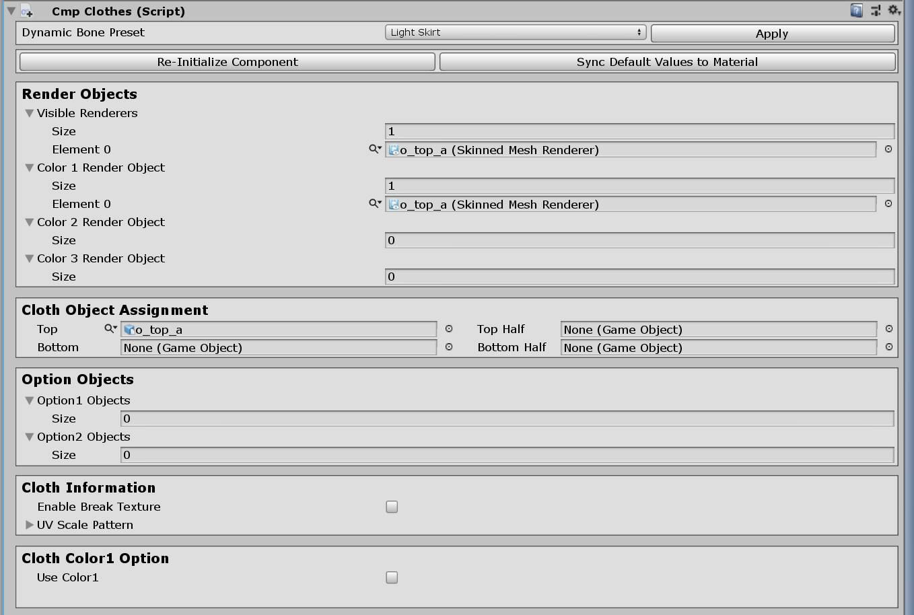
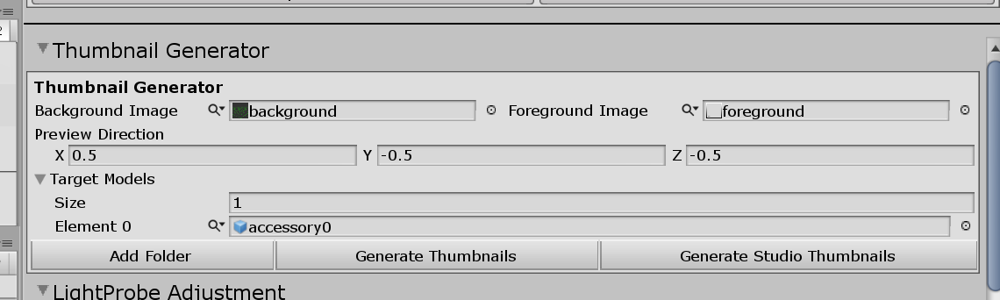

# Creating Custom Top

## Related Documents

This page only contains how to put hair models into the game with adjustable attributes.

If you need more basic information like setup folders or preparing hair assets, please visit the pages below before continuing to read this Document:

-   [Getting Started with the hooh's Modding Tool](getting_started.md)

-   [Setting up Folder](tutorials/gearing-up.md)

-   [Creating Clothing Mesh](prepping/clothing-mesh.md)

## Steps

?> This tutorial only provides information about putting existing mesh to the main game. Please check [Creating Clothing Mesh](prepping/clothing-mesh.md) Document if you want to know how to make a clothing model.

### Setting Up Assets

!> `.OBJ` format does not support FK studio items. Ensure that you're importing `.FBX` format 3D Mesh Files to make FK works on the model.

In this Document, I assume that you've read the previous Document that lets you know how to make the 3d model for character clothing.

If you haven't checked the Document yet, here is the link to the Document: [Creating Clothing Mesh](prepping/clothing-mesh.md)

First, put the model to the scene. The hierarchy does not matter, But make sure that `Clothing Tester` and your clothing are in the same position, angles, and scale.



### Initializing the Component


When you've done putting your mesh to the scene, click it, navigate the right panel, and click the `Initialize Modding Components > Common > Clothing` button.

Then the Modding Tool will automatically find the references in your model and initialize everything to make your model work in the game.

### Validating Component



Just in case when you didn't set things as the Document, you can manually review the component to check if it's going to work correctly in the game.

-   **Visible Renderers**

    First, if every `Skinned Mesh Renderer` is included in "Visible Renderers", you're good to go.

-   **Texture Render Objects**

    Second, There is "Texture X Render Object" below. To explain what they're for, you need to know that ILLUSION renders a new clothing texture when you change the game's color or clothing pattern.

    For that purpose, you can assign a maximum of 3 sets of colormask and diffuse textures in the Mod XML File.

    Each "Texture Render Object" group represents for each set of diffuse and colormask in the Mod XML File.

    But most of the case, we're going to use a single texture for the clothing so check that every renderer listed in Texture 1 Render Object.

-   **Options**

    You can assign togglable optional meshes for the clothing but remember that you can't toggle optional state in-game.

-   **Cloth Object Assignment**

    This section is for assigning the half-off state of the clothing. If you're making any clothing mod for Top/Bottom, Inner Top/Bottom, or Pantyhose Section, You need to assign the full state of the clothing in this section. Otherwise, It will not work properly.

    Ensure that the component is referencing Top/Bottom Clothing's Full and Half-off state meshes in the section.

-   **Cloth Colors**

    Well, as the title says, this is the color information of your clothing. If you enable each color option, you can color your outfit in the game.

    Unfortunately, you can't adjust a few sliders in the game if you're using the standard shader. To use all of the game options, you must use `Clothing Shader Replica` for your clothing material.

    You can find all of the included shader information inside the [Shader Informations](technical/shaders.md) Document.

    You can find all of the information about the included shader inside the [Shader Informations](technical/shaders.md) Document.

### Setting Colormask

AI/HS2 utilizes custom colormask texture to color the clothing's texture with various colors.

If you don't want to struggle with setting up colormask, you can draw a black dot and save it as png and call it colormask.

You can check [**ILLUSION Shader**](technical/illusion-shader.md?id=texturepattern-rendering-clothing) document for more detailed information about colormask

### Register Prefab

Drag your Gameobjects to the Project folder. Put your clothing model in the `prefabs` folder in your modding directory.

But if you have more than one clothing, I recommend you to create folders like this:

```
outfit01
outfit02
```

The Modding Tool can distinguish the same name assets with a hint, But you must avoid setting all meshes and texture to the same name.

### Optional: Generating the Thumbnail



You can generate thumbnails for the accessories you've made quickly with the help of thumbnail generator.

You still can generate the thumbnail without the background or foreground, but I recommend to have your format to distinguish your mod from other mods.

Unlike the studio thumbnail generator, the normal thumbnail generation will save its result to the `thumbs` folder of the folder where the project window is browsing.

### Creating Mod XML

```xml
<packer>
    <guid>example.clothing.text</guid> <!-- please change guid! -->
    <name>Example CLothing</name>
    <version>1.0.0</version>
    <author>My Name</author>
    <description>My first outfit mod</description>
    <bundles>
        <folder auto-path="prefabs" from="top00" filter=".*?\.(psd|png|tif|prefab)"/>
        <folder auto-path="prefabs" from="innertop00" filter=".*?\.(psd|png|tif|prefab)"/>
        <folder auto-path="thumbs" from="thumbs" filter=".*?\.(psd|png|tif)"/>
    </bundles>
    <build>
        <!-- If you put your clothing inside of regular top category, use example below-->
        <list type="ftop">
            <item
                    kind="0" possess="1" name="My First Outfit" state="0"
                    coordinate="1" mesh-a="MyPrefab" en-us="0"
                    no-bra="0" bodymask-bundle="0" bodymask-tex="0"
                     bramask-bundle="0" bramask-tex="0" breakmask-tex="0"
                    innermask-tb-bundle="0" innermask-tb-tex="0"
                    innermask-b-bundle="0" innermask-b-tex="0"
                    panstmask-bundle="0" panstmask-tex="0"
                     bodymask-b-bundle="0" bodymask-b-tex="0"
                    tex-main="MainTextureForMyOutfit"
                     tex-mask="ColorMaskTextureForMyOutfit" tex-main2="0" tex-mask2="0"
                    tex-main3="0" tex-mask3="0" hide-bottom="0" thumb="Thumbnail"
            />
        </list>
        <!-- If you put your clothing inside of inner top category, use example below-->
		<list type="fintop">
            <!-- if you set coordinate to "1", it becomes top/bottom set. -->
			<item
				kind="0" possess="2" name="[hooh] My Prefab" mesh-a="MyPrefab" state="0"
				coordinate="0" overbra-type="0" bodymask-tex="0"
				tex-main="MainTextureForMyOutfit" tex-mask="ColorMaskTextureForMyOutfit"
				hide-bottom="0" thumb="Thumbnail"
			/>
		</list>
    </build>
</packer>
```

!> The GUID, bundle name, build name should be **unique**, and you can only refer files in Asset Bundles in the Mod XML File.

You can check the comment inside of the XML Code section above to see what to do.

For more detailed information, you can check those documents for reference.

-   [XML File Structure](technical/xml-file.md) for general Mod File Information
-   [Auto-Path Lists](technical/autopath-list.md) for `<folder auto-path>`
-   [XML List Types](technical/category-list.md) for `<list type>` and `<item>`

### Build Mod


Drag and drop your custom mod XML file into the mod builder's target window.

After setting the build target, check if the output path is where you desire to put your custom zipmod archive.

If everything is okay, validate your XML file if you didn't make any mistake inside the XML file.

Unless a mod packer cannot find an asset or has some issue while resolving the Asset Bundle's path, it says nothing.

Then you're good to go. Press the big green button and to build the mod.

It depends on your mod size, but it will play a nice sound to notify the packing is done after a few seconds or minutes.

### Trouble Shooting

!> If you can't find the issue here, then check [**Trouble Shooting**](tutorials/trouble-shooting.md) page.
