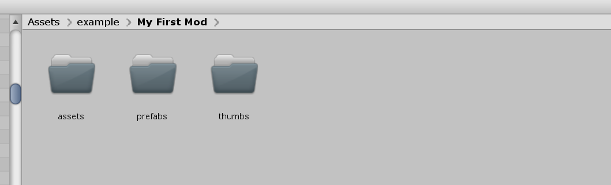
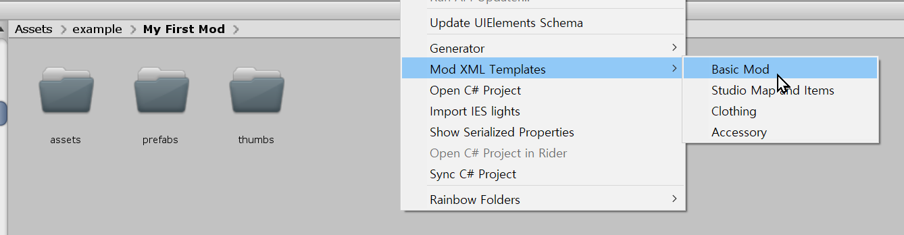

# Setting up Folder

Setting up a folder is the most crucial first step you're going to do in the processing of making a mod for HS2/AI.
Every mod for the game are consists of assets and data with no exception.

## Creating Temporary Folder



You may have a nice folder structure in your mind but first, try the default modding tool layout to experience the modding tool as soon as possible.

Create these folders below with no questions:

-   `prefabs`

    This folder is for storing processed game objects for the game.

-   `thumbs`

    This folder is for storing thumbnails for your accessory/clothing/studio items.

-   `assets`

    This folder is for the core assets like storing textures, models, and materials.

## Create XML file



This XML file is the pillar of this modding tool. This XML file will contain all of the data of your mod.

You have a few options to create an XML file into your folder.

-   Creating by yourself
-   Using "Generate XML File"
-   Using "Template XML File"

I recommend using "Template XML File" if you have no idea what you're doing.

It might feel restrictive, but if you don't have any plan to read all documentation and learn the core of unity programming, it's okay to not think about anything in the trade of small nuisance.

## Validating your folder


If you followed the manual so far, You could see those files and folders in your custom mod folder.

```
prfabs
thumbs
assets
mod.xml
```

If you everything on the list in your folder, you're good to go! Now it's time to read other documents with an actual tutorial to create new content for HS2/AI!

Congrats! You're ready to be a new modder!
