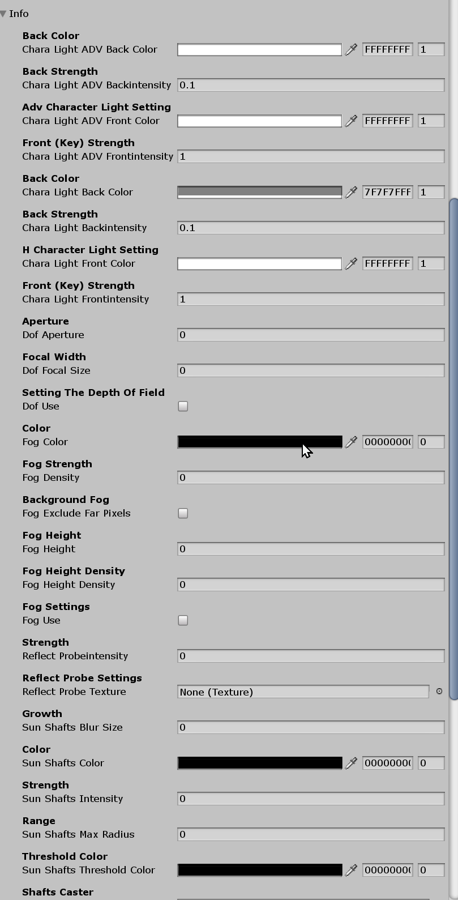
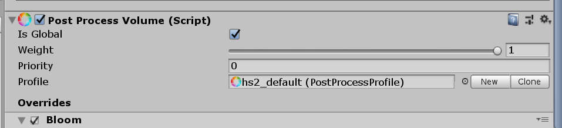
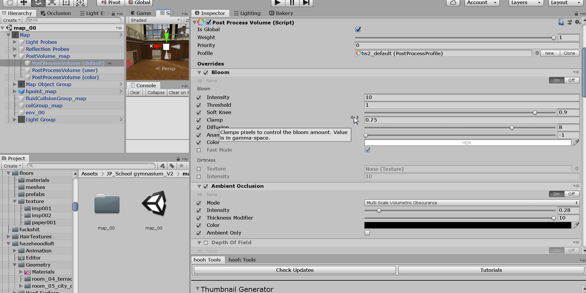
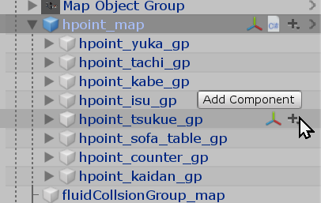
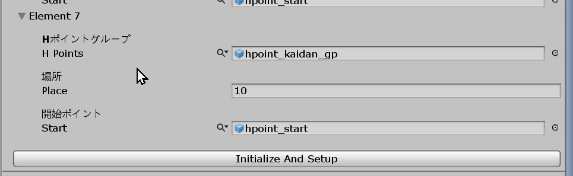
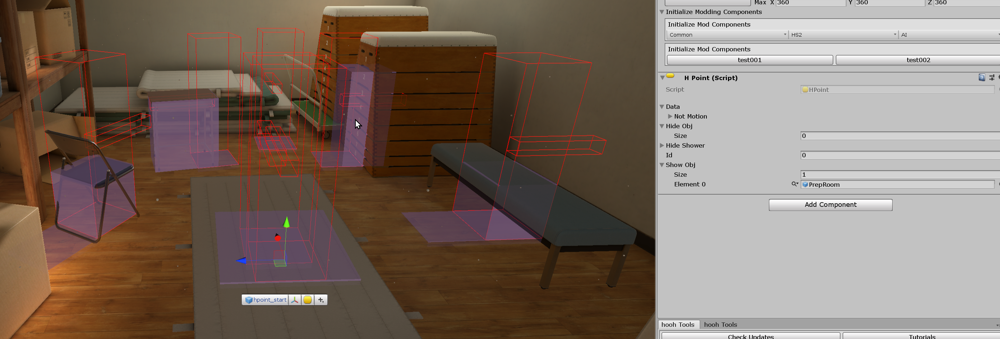
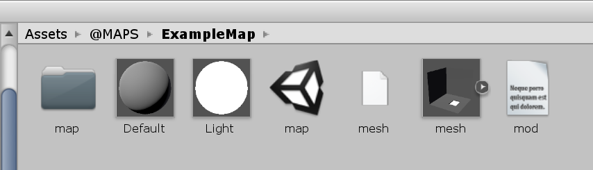
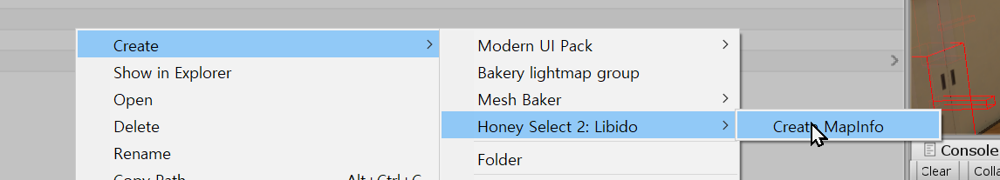
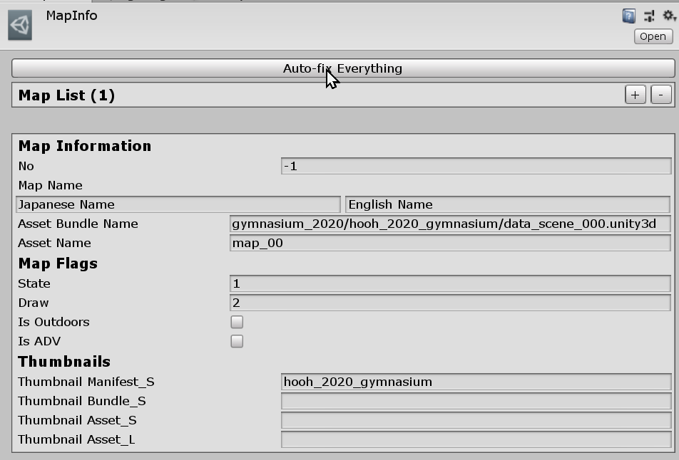

# Creating Custom HS2 In-Game Map

!> Honey Select 2 Main-Game Map Integration is still in development. There might be unexpected critical failures that I missed to fix. Reporting a bug is one way to contribute to the development and save everyone's time.

## Related Documents

If you need more basic information like setup folders or preparing hair assets, please visit the pages below before continuing to read this Document:

-   [Getting Started with the hooh's Modding Tool](getting_started.md)
-   [Setting up Folder](tutorials/gearing-up.md)
-   [Studio Maps](tutorials/studio-map.md)

## Steps

### Validate the map

Ensure that every single mesh objects are inside the `Layer 11 (Map)` layer and if you're planning to bake any mesh, then check if the objects are set properly to static.

After the conversion process, modifying the map will be a bit harder than before, so I recommend making all the changes before converting the map for the HS2 Main-Game.

### Converting the map

In this Document, You must have base scenes from [Studio Maps](tutorials/studio-map.md) Tutorials.

Since this process requires irreversible conversion, I recommend making the backup before proceeding.

Navigate to the top menu and click the `hooh Tools > Convert to HS2 Map`. It does not have any confirmation dialog so ensure that you have the **BACKUP** before pressing the button.

### Adjust the Components

You can adjust the components to make your map feels different in the game.

#### Adjusting overall lights

The main-game utilizes more lights than embedded map lights. Go to the Root map object and Navigate to `Sun Light Info` Component.

Every single value is pretty self-explanatory.



#### Adjusting Post-Processing

Post-Processing is an important factor to preview how the map will look like in the game.

Place `Post Processing Camera (DELETE ME BEFORE BUILDING MOD)` Object from the `Base Files` folder. It will let you preview the Post-Processing and help you float around in the Play Mode.



Before adjusting any value, I recommend that you clone the `hs2_default` Post Processing Profile by clicking the "Clone" button.



You can find detailed information about Post-Processing Effects in the Official .

If you don't grasp the concept of the Post-Processing, there is a good video explanation about Post-Processing from the youtube channel called "Brackeys".

### Adjust H-Points



You can see `hpoint_map` inside of the root map object.



I've added all possible h-points in there for default, But I recommend you to use this setup. Don't forget to press the `Initialize And Setup` button in `hpoint_map` after you've done adjusting your h-points.



Setting the scene wouldn't be that hard. I've integrated approximate positions of h-points, so you don't have to launch the game to adjust the position constantly.

You can hide or show objects depends on the active h-point in the game.

### Save Scene



Save the scene to your mod folder. To avoid confusion, I recommend making a folder like `scenes` or `map00`.

But do not put multiple maps into one folder if the level has baked lightmaps. But you can put variants of the map that is using the same lightmap in the same folder.

### Creating Thumbnail

#### Creating with Photoshop

!> This step requires Photoshop or something equivalent

Check Thumbnail Examples in HS2 Main-Game Examples. There are two photoshop files in the thumbs folder.

Take a screenshot of your map and replace the image inside of the photoshop files.

#### Creating with Python

!> Coming soon

```bash
python /q/psdtemplates/makeimg.py 0.png "Gymnasium Morning" ../map_00
python /q/psdtemplates/makeimg.py 1.png "Gymnasium Noon" ../map_01
python /q/psdtemplates/makeimg.py 2.png "Gymnasium Night" ../map_02
```

### Setting up MapInfo



Create the `MapInfo` asset to hint the main-game that it can use a new map for their games.



#### Setting up automatically

You need to register the thumbnails and the scene in Mod XML File first to generate everything automatically.

Check these documents if you still don't get how Mod XML Files are working. - [XML File Structure](technical/xml-file.md) - [Auto-Path Lists](technical/autopath-list.md) - [XML List Types](technical/category-list.md)

After setting up the thumbnails and scenes to Mod XML Files, Find and click the `MapInfo` you've created.

Type your scene name in the `Asset Name` in the inspector and press the "Auto-fix Everything" button to generate basic information.

It will automatically assign the thumbnails, asset bundle names, and the manifest based on the Mod XML Files.

If nothing is getting generated, check if you properly registered the Mod XML files assets.

Also, there is one exception for the map thumbnails. For Map Thumbnails, all of the map thumbnails must comply following name format:
`{Scene Asset Name}_thumb_s` for small thumbnail for Free-H
`{Scene Asset Name}_thumb_l` for large thumbnail for Event Map

The modding tool will generate the map's ID incrementally based on the first element of the `MapInfo`.

#### Setting up manually

If you hate automatic generation, you can put everything manually.

-   `No`: The ID of the map. It supports 32-bit ID, so choose your ID freely. Just remember, the ID must be unique to all other available maps.
-   `Map Name`: The name of the map. `Japanese Name` will be the main name for "Free-H" and the Event Menu.
-   `Asset Bundle Name`: The Asset Bundle path for the scene asset.
-   `Asset Name`: The Scene Asset's name
-   `State`: Seems like editor use only.
-   `Draw`: Seems like editor use only.
-   `Is Outdoors`: Seems like editor use only.
-   `Is ADV`: Whether if the map if only for the events or not.
-   `Thumbnail Manifest S`: Manifest Bundle for thumbnails. as
-   `Thumbnail Bundle S`: Asset Bundle path for thumbnails. It will be the same for the S - and L size.
-   `Thumbnail Asset S`: the Small Size Thumbnail's Asset Name.
-   `Thumbnail Asset L`: the Small Size Thumbnail's Asset Name.

### Setting up SceneInfo

The modding tool will generate the event scene info. So, don't worry.

### Setting up Collider

!> This step will be described later when we find a better way to implement a camera collision hider.

### Creating Mod XML

```xml
<packer>
    <guid>example.studio.map</guid>
    <name>My First Studio Map</name>
    <version>1.0.0</version>
    <author>My Name</author>
    <description>My first outfit mod</description>
    <options>
         <!--
            If you're planning to release studio items with the map,
            I recommend you to put use-dependency on option for more
            perfomance and smaller size of zipmod.
          -->
          <use-dependency />
    </options>
    <bundles>
        <folder auto-path="maps" from="map00" filter=".*\.unity" target="map00"/>
        <folder auto-path="mapdata" from="map00" filter=".*\.asset" target="map00" />
    </bundles>
    <build>
        <list type="map">
            <item name="My First Studio Map" scene="map_00" />
        </list>
    </build>
</packer>
```

!> The GUID, bundle name, build name should be **unique**, and you can only refer files in Asset Bundles in the Mod XML File.

You can check the comment inside of the XML Code section above to see what to do.

For more detailed information, you can check those documents for reference.

-   [XML File Structure](technical/xml-file.md) for general Mod File Information
-   [Auto-Path Lists](technical/autopath-list.md) for `<folder auto-path>`
-   [XML List Types](technical/category-list.md) for `<list type>` and `<item>`

### Build Mod


Drag and drop your custom mod XML file into the mod builder's target window.

After setting the build target, check if the output path is where you desire to put your custom zipmod archive.

If everything is okay, validate your XML file if you didn't make any mistake inside the XML file.

Unless a mod packer cannot find an asset or has some issue while resolving the Asset Bundle's path, it says nothing.

Then you're good to go. Press the big green button and to build the mod.

It depends on your mod size, but it will play a nice sound to notify the packing is done after a few seconds or minutes.

### Test In-Game

Test your map is working in the game. You can find your custom map in the map section.

### Trouble Shooting

!> If you can't find the issue here, then check [**Trouble Shooting**](tutorials/trouble-shooting.md) page.

#### My map is weirdly placed in the game.

Place Root Object of Map `Position 0,0,0`, `Angle 0,0,0`, and `Scale 1,1,1` in `Transform` Component Inspector.

#### Map does not get lit by any lightings

Ensure that all of the game objects in `Layer 11 (Map)`. As I wrote in the Document, It will not get lit unless the objects are in the `Layer 11 (Map)`.
