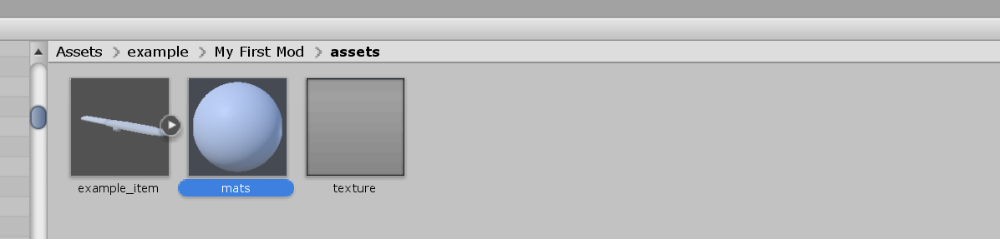
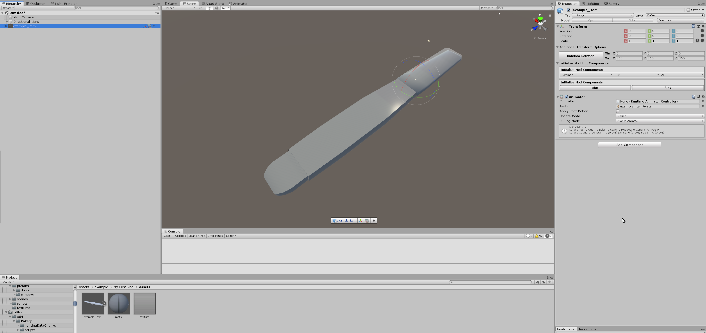
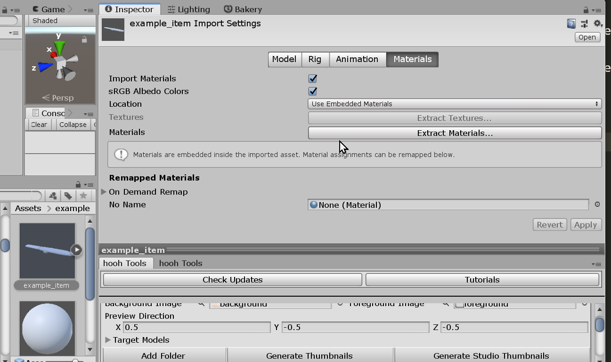
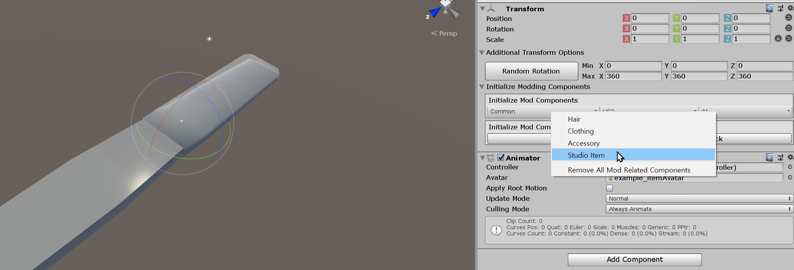
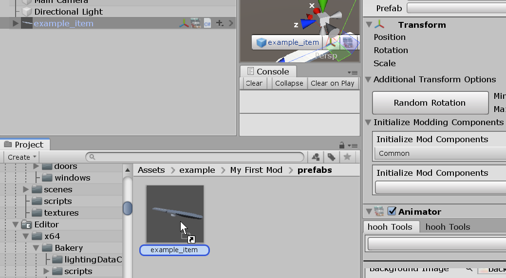
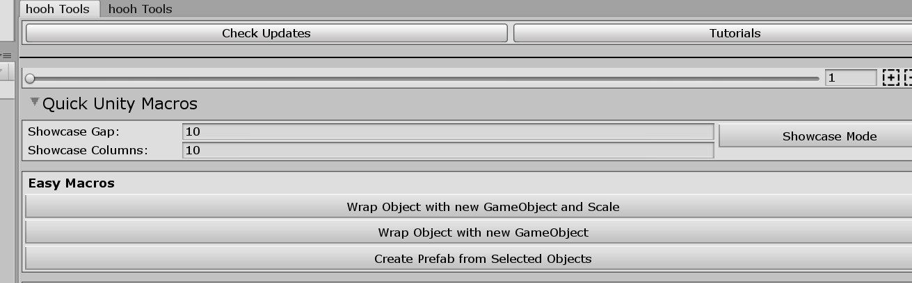
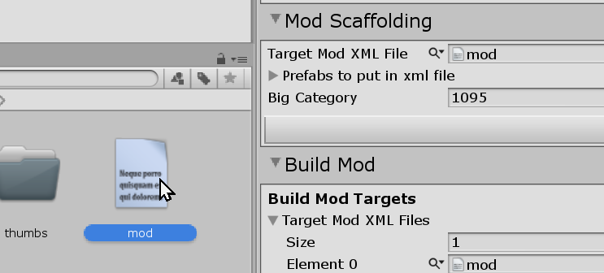
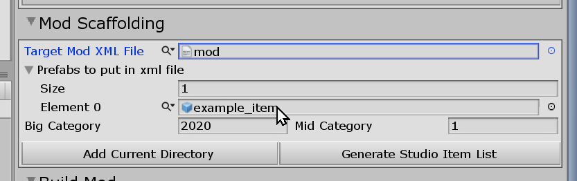
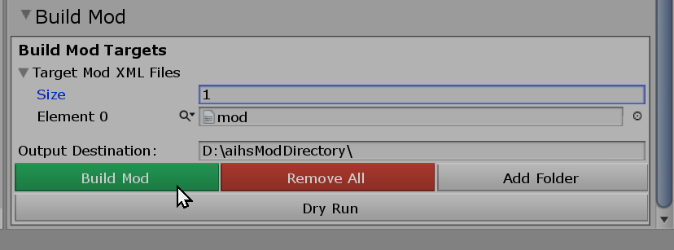

# Creating Custom Studio Item

## Related Document

This page only contains how to put hair models into the game with adjustable attributes.

If you need more basic information like setup folders or preparing hair assets, please visit the pages below before continuing to read this document:

-   [Getting Started with the hooh's Modding Tool](getting_started.md)
-   [Setting up Folder](tutorials/gearing-up.md)

## Steps

### Putting Assets

!> `.OBJ` format does not supports FK studio items. Make sure that you're importing `.FBX` format 3D Mesh Files to make FK works on the model.



Import or make the 3D asset and drag and drop into `assets` folder in your mod folder

It would be best to import all textures, models, and all other required assets to the Unity Editor.

Once you put all assets to the folder, create related materials for the model.



After setting up all materials, Put the model on the scene, and rig up the material.



You can also assign materials in the model import menu that you can see when you click the model.

### Setting up assets



When you've done making model work in the Unity Editor, you need to mark your model with the component to make your model work in the game.

This step was pretty painful back in the day, and thankfully it's properly automated with the power of hooh's Modding tool.

Go to the `Transform` section. It's mostly placed on the right top of the screen.

You can see the "Initialize Modding Components" button with a brighter background.

Click `Common > Studio Item` then you're mostly done with setting up the model.

You can apply multiple objects at once when you selected many items in the scene.



After marking all of the items as `Studio Item`, it's time to register them as `prefab`.

Drag and drop to the project folder. Make sure that you're in the `prefabs` folder in your mod folder directory.

Unfortunately, you can't register multiple items as prefabs by drag and drop to the project folder.

But, there is a solution. Go to hooh's modding tool window and find `Create Prefab from Selected Objects`.



The button is in the `Quick Unity Macros` fold groups in the window. You can easily find the button once you open the foldout menu.

This button will register multiple selected items as `prefab` to the current folder.

### Registering Item



When you've registered all items as prefabs in the `prefabs` folder, you need to let the game know that it can reference those models.

You can reference those prefabs in the Mod XML files.
As the previous [Setting up Folder](tutorials/gearing-up.md) document said, you can make Mod XML files with templates.

You can easily start out making new Mod XML files by right-clicking in the folder and find `Mod XML Template > Studio Maps and Items`

#### Manually Modifing XML File

```xml
<packer>
    <guid>ex.mollit.nulla</guid>
    <name>Template Mod</name>
    <version>0.0.1</version>
    <author>Anonymous</author>
    <description>Template Studio Maps and Item Mod - Made with hooh's Modding Tool</description>
    <bundles>
        <folder auto-path="prefabs" from="prefabs" filter=".*?\.prefab" />
        <move auto-path="studiothumb" from="thumbs" filter=".*?\.png" />
    </bundles>
    <build>
        <list type="bigcategory">
            <!-- this id should be unique -->
            <item id="2020" name="Example Big Category" />
        </list>
        <list type="midcategory">
            <item big-category="2020" id="1" name="Example Mid Category" />
        </list>
        <list type="studioitem">
            <!-- add items in here. -->
            <!-- object is the prefab name. -->
            <!-- name is the name that you want to disply in the game -->
            <item object="example_item" name="Example Item" mid-category="1" big-category="2020" />
        </list>
    </build>
</packer>
```

!> The GUID, bundle name, build name should be **unique**, and you can only refer files in Asset Bundles in the Mod XML File.

You can check the comment inside of the XML Code section above to see what to do.

For more detailed information, you can check those documents for reference.

-   [XML File Structure](technical/xml-file.md) for general Mod File Information
-   [Auto-Path Lists](technical/autopath-list.md) for `<folder auto-path>`
-   [XML List Types](technical/category-list.md) for `<list type>` and `<item>`

#### Using "Mod Scaffolding"



-   Go to the "hooh's Modding Tool" window and navigate to the "Mod Scaffolding".

    

-   Go to the prefab folder where prefabs are stored.

-   Drag and drop prefabs to the "Prefabs to put in XML file". You can drag multiple objects by dragging objects right above the text.

    

-   As the title suggests, it will automatically register the prefabs you've dragged into the XML file.
-   Adjust the big category and mid category number to what you want to use. be sure that those ids are not in use or you're going to have some bad time solving the conflict in the game.

### Build Mod



Drag and drop your custom mod XML file into the mod builder's target window.

After setting the build target, check if the output path is where you desire to put your custom zipmod archive.

If everything is okay, validate your XML file if you didn't make any mistake inside the XML file.

Unless a mod packer cannot find an asset or has some issue while resolving the Asset Bundle's path, it says nothing.

Then you're good to go. Press the big green button and to build the mod.

It depends on your mod size, but it will play a nice sound to notify the packing is done after a few seconds or minutes.

### Trouble Shooting

!> If you can't find the issue in here then check [**Trouble Shooting**](tutorials/trouble-shooting.md) page.

## Field Manual

### When your studio mod is so big and each prefab shares many things in common

_Difficulty: Lazy_

-   Separate texture sets with several subfolders
-   include `<use-dependency>` option mod.xml here is the example.

    ```xml
    <author>hooh</author>
    ...
    <options>
        <use-dependency />
    </options>
    <bundles>
        <folder auto-path="prefabs-split" from="prefabs" filter=".*\.prefab" grouped="true" />
        <move auto-path="studiothumb" from="thumbs" filter="*\.png" />
        <folder auto-path="maps" from="map00" filter=".*\.unity" target="map00" />
    ...
    ```

    For more detailed information, you can check those documents for reference.

    -   [XML File Structure](technical/xml-file.md)
    -   [Auto-Path Lists](technical/autopath-list.md)
    -   [XML List Types](technical/category-list.md)

-   Now Mod Packer will pack textures in separate bundles and each prefab bundles will reference that texture.
-   Keep in mind that once you enabled this option your mod is now dependent to "Dependency Loader Plugin"

#### When you want to check if mod.xml is valid without building the mod

_Difficulty: Sloth_


-   Press the "Dry Run" Button inside of the Mod Builder Menu.
-   If everything is good, it will not display any message but a nice blip sound.
-   If something went wrong, it will display some dialog and print detailed information to the unity console.
-   You can open the unity console with the "Ctrl+Shift+C" key anywhere.

### When you want to add stylized Studio Item Thumbnails

_Difficulty: Low_

-   Make Foreground Image or Background Image. It can be transparent but the result icon will not be transparent due to the policy of the Item Finder Plugin

-   Make sure that those images that you've mode are 64x64 image. It is recommended to have smaller size icons.

-   Make sure that those images that you've made are **"Read/Write Enabled"** or unity will refuse to utilize your foreground/background texture.

    

-   Make sure your studio items are registered inside of mod.xml (Studio Thumbnail Generator will only generate registered items inside of mod.xml)

-   Drag and drop prefabs to Thumbnail Generator (or press the "Add Folder" Button to register all of the prefabs inside the folder that you're looking at)

-   Press the "Generate Thumbnails" Button to generate thumbnails.

-   Add `<move>` tag to your mod.xml here is some template with an explanation.

### When you have to generate dozens of studio items into mod.xml

_Difficulty: Easy_

### When you have to make things multi colorable

_Difficulty: Nut_

-   If you need to make different parts colored with 3 different colors in the studio you'll need a lot of works. prepare some meals before doing this.
-   You need a basic understanding of 3D art from this point. If you don't know "Materials", "UV Map", "Texture Painting", "Basic of Blender" then I suggest you look at those first before doing this.

### When you have to add your own component

_Difficulty: Chad_

-   If you want to add a new custom script component embedded into your studio item you need to understand how C# and Unity are working.
-   There is no way to add the custom component unless it's registered in the main/studio game like "Lux Water", "MirrorReflection".
-   Custom script will not work with a custom plugin. If you have some plan to add an awesome thing, it is a good time to set up a GitLab Account.
-   Since the whole process is too large, I'm going to pinpoint the landmark where you need to focus on this document. - You still can hit me up or ask for help in the "#moddiscussionn" in the "Illusion Discord Server"
-   All of your custom components need to have a custom namespace to be loaded with the Asset Bundle natively.
-   You can set up a custom namespace with the "Assembly Definition" feature in the Unity. I suggest you read the official document before trying it out by yourself.
-   Your custom plugin must have the same namespace as Assembly Definition you've registered in your unity project.
-   You need to code your own control UI and Save/Load values to adjust values on the go in a nice manner.
-   Do not include editor features inside of the component. please filter them out with pre-processor block

### When you have to animate your studio item

_Difficulty: Nasty_

-   You need basic animation for your model. Animate with 3D software like blender or animate with unity.

-   I'll update this section later when i have nice template model to showcase how to add custom animated model.
