# How to make hairs

don't forget to watch, star and share the repository to not miss further instructions. Idaf about stars but people who want to create new hairs need to watch this so yeah.

## Requirement
- Nice above-average IQ
- basic knowledge of 3D Modeling
- basic knowledge of Unity Engine
- 3D Tools like blender or 3dsmax
- Untiy Editor 2018.2.21f
- Photoshop or GIMP
- Latest SB3Utility 

## Steps

### Import Assets

If you setup your own modding project in unity editor then you need to import assets to get started. 

You can get nice small prepared assets [here](https://github.com/hooh-hooah/AI_Tips/tree/master/files).

### Prepare Scene

Now you need to prepare your scene Export head mesh/object from the game and place it nicely to see what's going on in one glance. You can get my workspace from this [location](https://github.com/hooh-hooah/AI_Tips/tree/master/files/workspace).

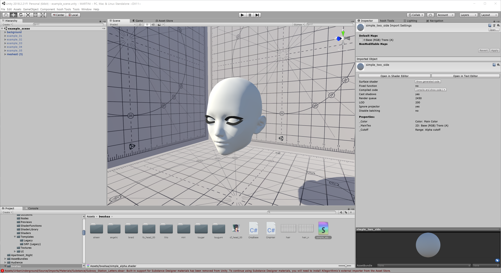

### Setup Meshes

After then, prepare some nice mesh to put on. You can use any 3d editing tool. The minimum requirement for the hair object is a bone and a mesh.

If you want to make your hair move then you need to add more then 2 bones. also, the more bone is the more smooth it feels. 

I'm not going to explain the basic of 3D modeling here. you can go Youtube to search some nice infromations about how to use 3D software. You'll need to learn following things: basic mesh editing, culling, basic setup, vertex weighting, rigging.

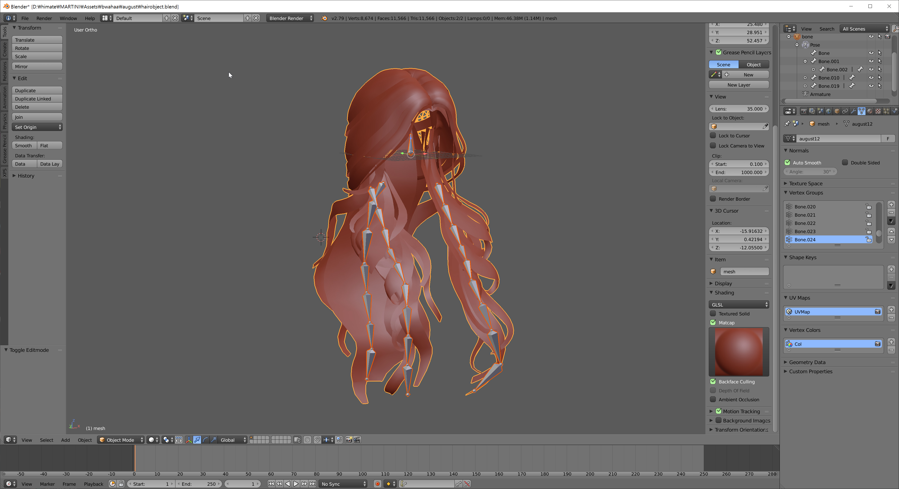

### Prepare Assets

Once you're done with making hairs, import it in Unity Editor. as long as unity editor can read, the format is not really matters. 

After importing your mesh put your object on following object
`p_cf_head_00>cf_J_FaceRoot>cf_J_FaceBase>cf_J_FaceUp_ty>anything` 
For my case, I've put my object like this. Just to accurately replicate in-game behavior/structure. It's up to you . You find the method the most works for you.

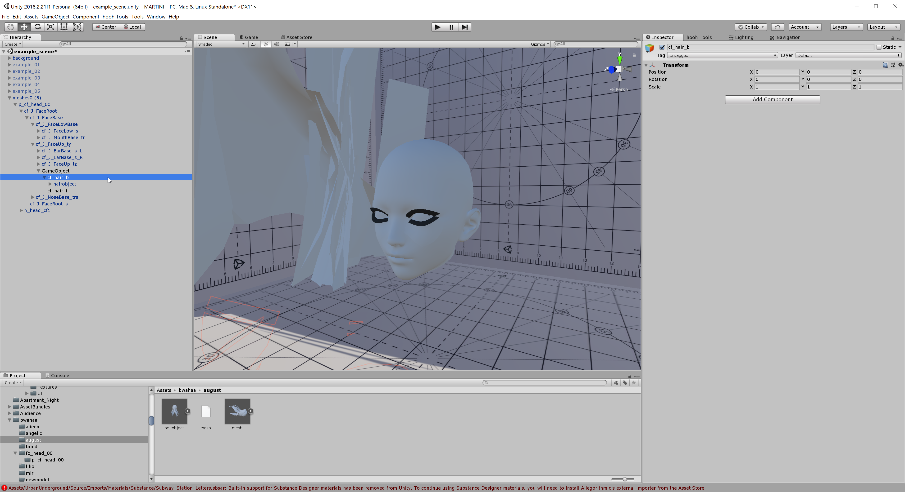

After then you can nicely adjust your hair. Be careful, You need to scale with import scaling not editor scaling. the root of the hair mesh and bone should be scale of 1,1,1!

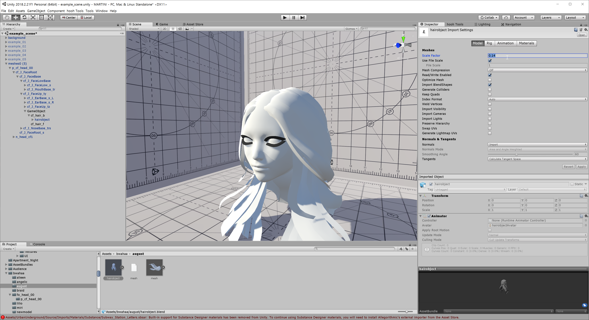

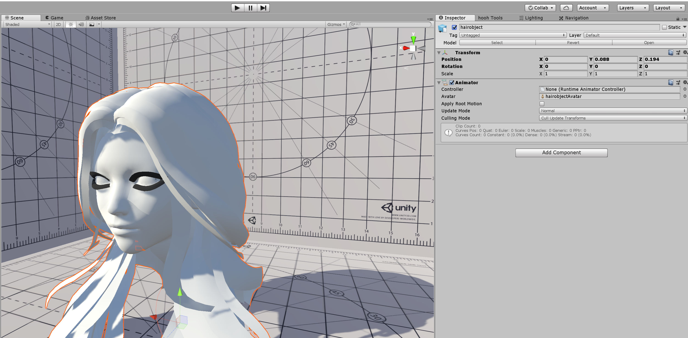

When you're done, import textures and make "Double-Sided" Material because the game's internal shader is using double-sided hair shader.

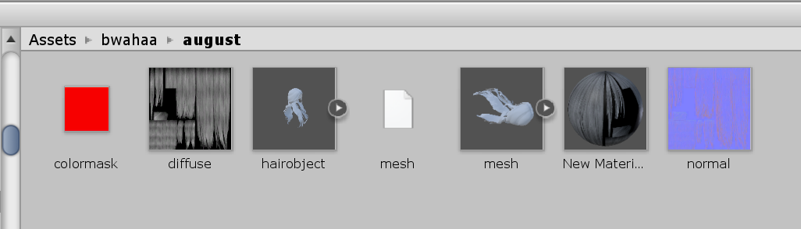

- colormask: the colormask for your hair. I'll get to this later, If you don't know anything just make small plain red texture and call it colormask. you can download it [here](https://github.com/hooh-hooah/AI_Tips/blob/master/files/colormask.png).
- diffuse: the main color of your hair. The hair shader will use this to determine your hair's opacity and look.
- normal: bumpiness of the hair. do not use strong normal map. It will result ugly hair material in game.

This is what it should looks like after making nice double-sided material from your hair's diffuse and normal maps. Don't worry about unused textures. The material that you're working on is only exist to preview your hair in Unity Editor. It's not for In-Game Use.

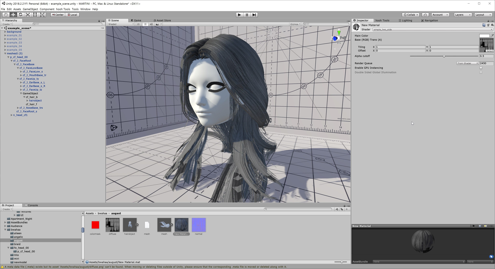

If something does not looks, good adjust it.

This is my final result. After when you're done, you need to add some information about your hair. 

### Set Rendering Layer of your Hair

First of all, you need to change your hair's Layer. the layer is used to filter lighting/rendering on everything In-Game. Your hairobject should be in group A, which is 11 is decimal.

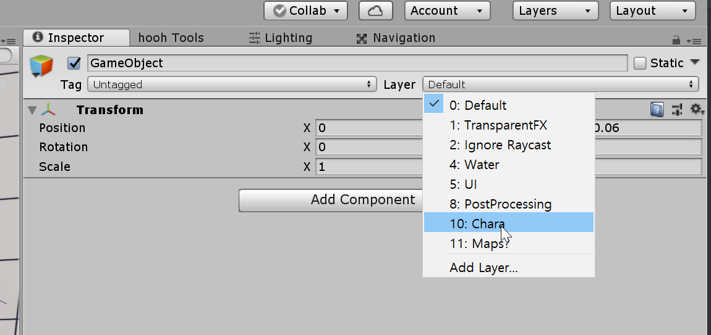

Press change children when Unity Editor asks anything. Everything should be in Character layer anyway.

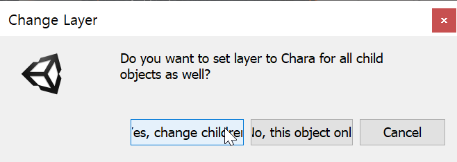

### Set Information of your Hair.

Once you've made your hair, you need to insert some information of your hair so game can parse it and use it In-Game. 

You're going to use CmpHair component, which can be found [here](https://github.com/hooh-hooah/AI_Tips/blob/master/files/CmpHair.cs). You'll need [CmpBase.cs](https://github.com/hooh-hooah/AI_Tips/blob/master/files/CmpBase.cs) to compile it properly. so put those things together.

Add CmpHair on your Hair Object like this.

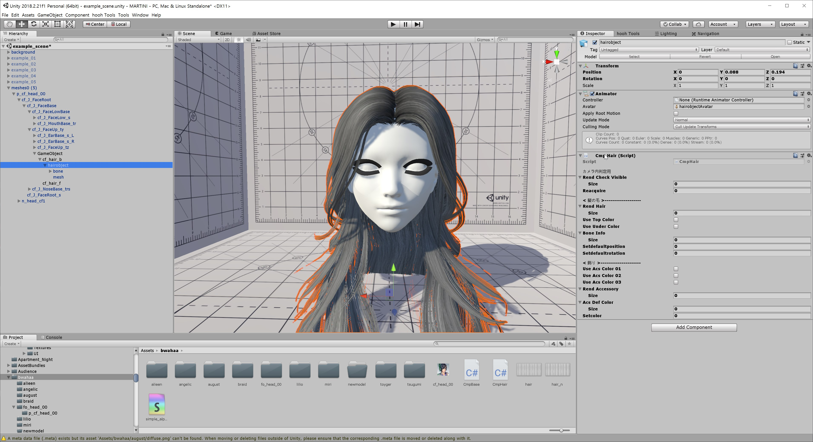

After adding CmpHair, drag your "mesh" or any component that has "SkinnedMeshRenderer" into RendCheckVisible and RendHair. You don't need to increase size first. as soon as you drag your object to text, Unity Editor will automatically increase size and add element on the array.

You can add more informations like:

- Use Top Color: whether use top hair color or not. coloring area will be determined by colormask.
- Use Under Color: whether use under color or not. coloring area will be determined by colormask.
- Bone Info: Bone adjustment Information. You need to manually increase array size to add more information.
- SetDefaultPosition: Whether use default position or not. not really known atm. title pretty much explains it but I don't know what it does yet. 
- SetDefaultRotation: Whether use default rotation or not. not really known atm. title pretty much explains it but I don't know what it does yet.
- UseAcsColor01: Whether use accessory's color or not. coloring area will be determined by object's colormask
- UseAcsColor02: Whether use accessory's color or not. coloring area will be determined by object's colormask
- UseAcsColor03: Whether use accessory's color or not. coloring area will be determined by object's colormask
- AcsDefColor: Whether use accessory's default color or not. not really known atm.
- SetColor: Whether use color manipulation for accessory or not.

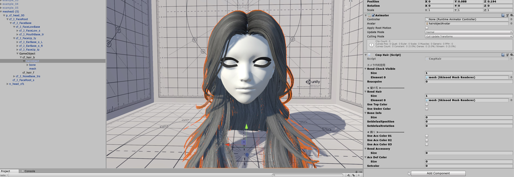

Not everything is necessary, but RendCheckVisible and RendHair is critical to draw your hair. so you can forget everything but those two.

### Add Behavior of your Hair.

If you have long hair, it's expected be affected by external force or gravity. there is a lot of way to do it, but I'm using ILLUSION's way - DynamicBones.

DynamicBone is a Unity Asset can be purchased in [here](https://assetstore.unity.com/packages/tools/animation/dynamic-bone-16743). *You can do other things* but I suggest you to purchase the plugin from the asset store for the most stable experience.

Since it's really complicated I suggest you to experiment it with Play Mode first. You can set values in editor and see how they're moving in Play Mode by moving around your root head object.

I suggest you to go some VRChat Dynamic Bone tweaking Tutorial. They have more information than me. I'll more focus on how to add new hairs on the game.

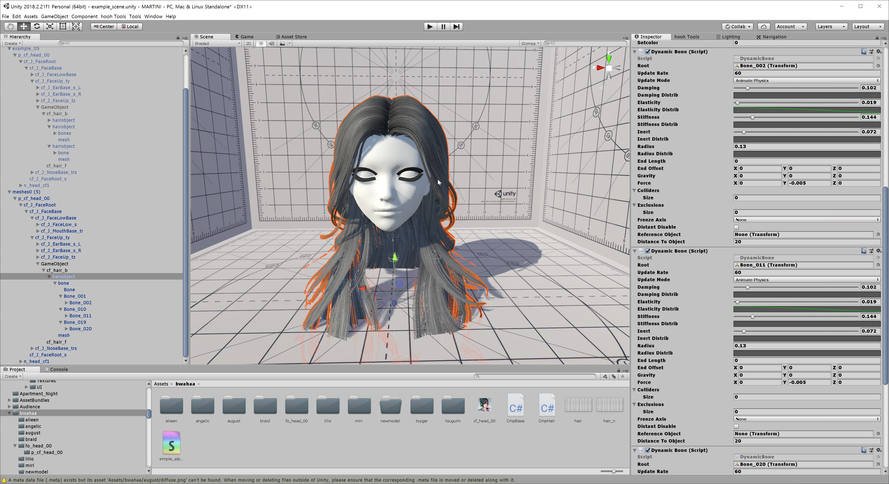

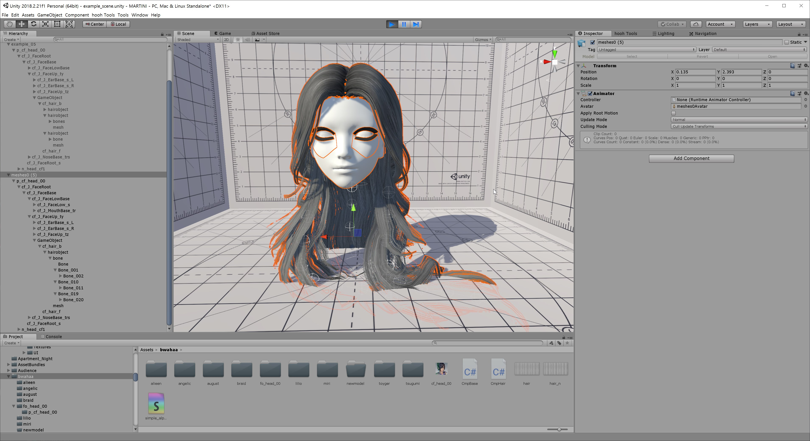

### Register your hair and Export.

Once you're done tweaking your hair's behavior, you need to register your hair object as Prefab in order to export it as Asset Bundle.

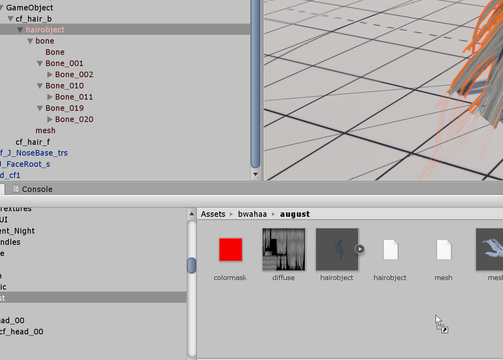
Register your hair as Prefab by dragging your hairobject to explorer and add your hairobject to assetbundle like this

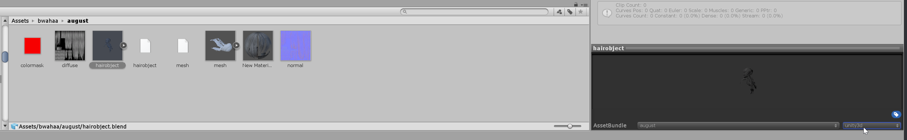
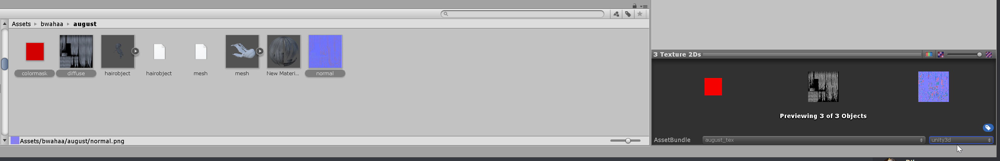
You need to separate into two asset bundles. one for mesh and material, one for texture. I don't know exact reason but when you put everything in one pack, the chance of the game failing to load your asset bundle goes up.

After doing so, check that you have my modding tool if you don't have it you're not going to get this menu. (or you can make your own.)

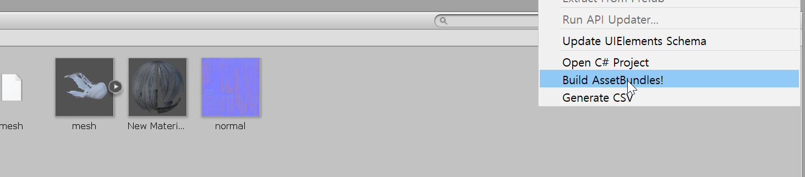
Build Assetbundles, and move built assetbundles to nice place to remember.

### Replace Shader and Link Textures

Once you're done

We don't have hair shader replica atm, so we need to replace the shader to make it work nicely in game. I have example material .unity3d file in [here](https://github.com/hooh-hooah/AI_Tips/blob/master/files/hair_material.unity3d)

Follow this step.

1. Open Hair Asset Bundle, Hair Texture Asset Bundle, Material Asset Bundle

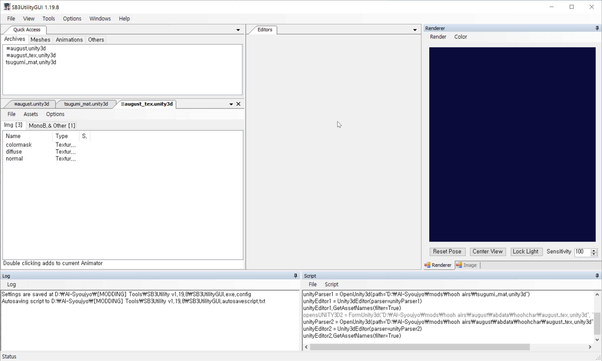

2. Switch to texture asset bundle and Click all Textures.

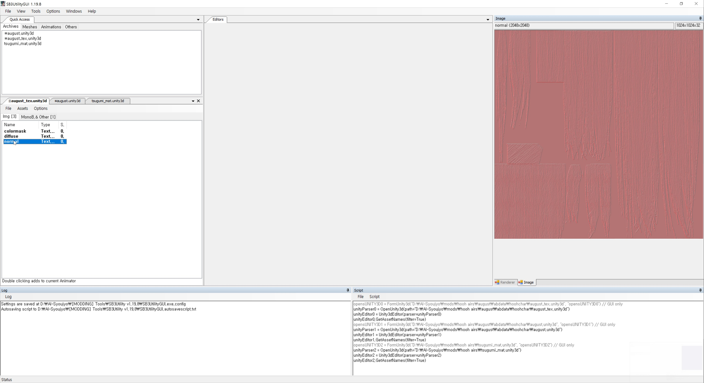

3. Switch to material asset bundle and mark for copy 'hairmat'

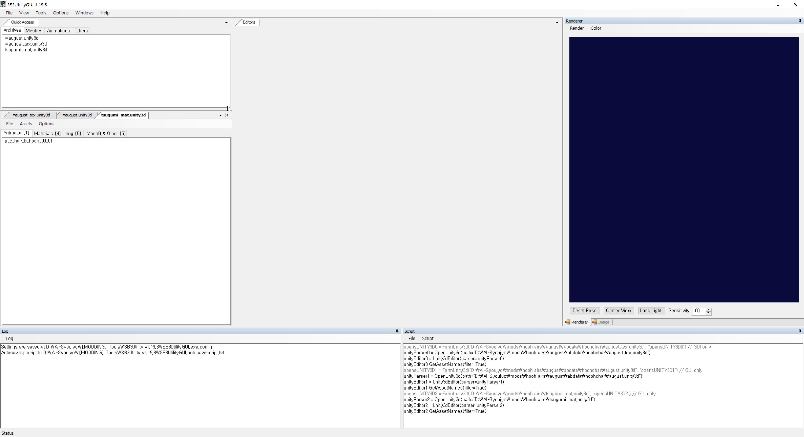
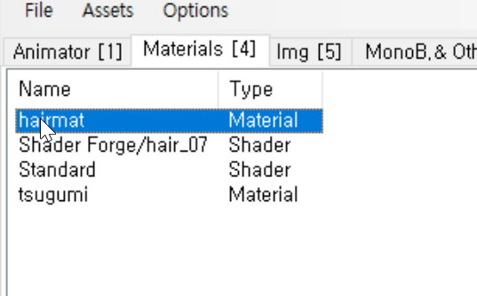
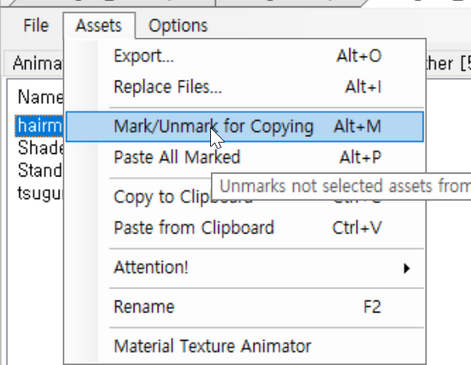

4. Switch to Hair Asset Bundle and paste hairmat

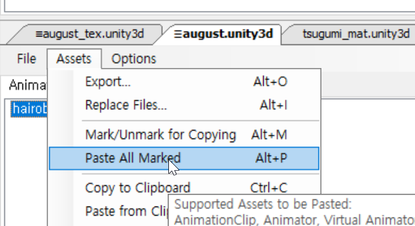

5. change mesh material to hairmat

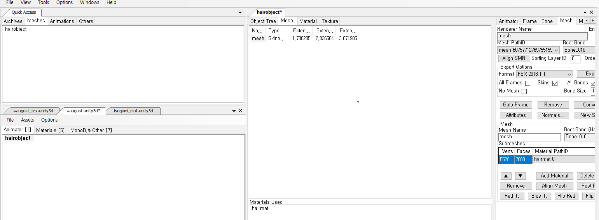

6. change material texture

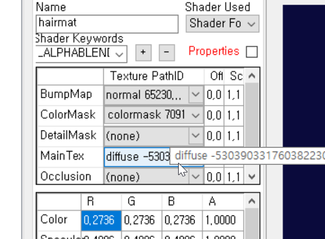

### Pack it as Sideloader Mod

You can add your hair to list by using this template.

### Test it up

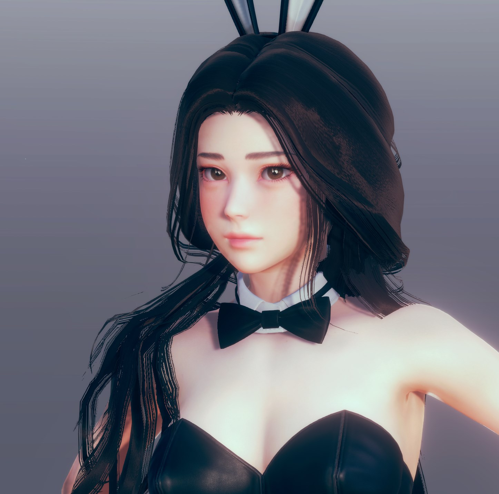
Pack it into sideloader mod!

### Checklist

- Did you marked your prefab and textures in assetbundle?
- Did you added CmpHair Component?
- Did you setup CmpHair properly?
- Did you setup Dynmaic Bones?
- Did you setup Dynamic Bones properly?
- Did you make nice textures?
- Did you changed hair material's shader to ILLUSION's nice hair shader?
- Did you made it into a siderloader mod?

- <u>**Did fucking you re-zipped the mod to update?**</u>

## FAQ

- Bruh dithering
  
  embrace it or make your own shader you coomer
  
- What the hell? I can only use ONE MATERIAL?

  yes and it's not my fault. blame ILLUSION
  
- Do i have to change shader every sigle fucking time?

  atm, yes. Expect me to make new hair shader replica or you can just keep doing it.

## Troubleshooting

- Oh noes, my model's normal is god damn fugly

  Try "Set Normal" in blender.

- Why is my mod is not updating?

  <u>**Did fucking you re-zipped the mod to update?**</u>
  
- Hair texture is not transparent/is flat

  Did you referenced hair texture in prefab assetbundle from list? then please. separate the assetbundle.