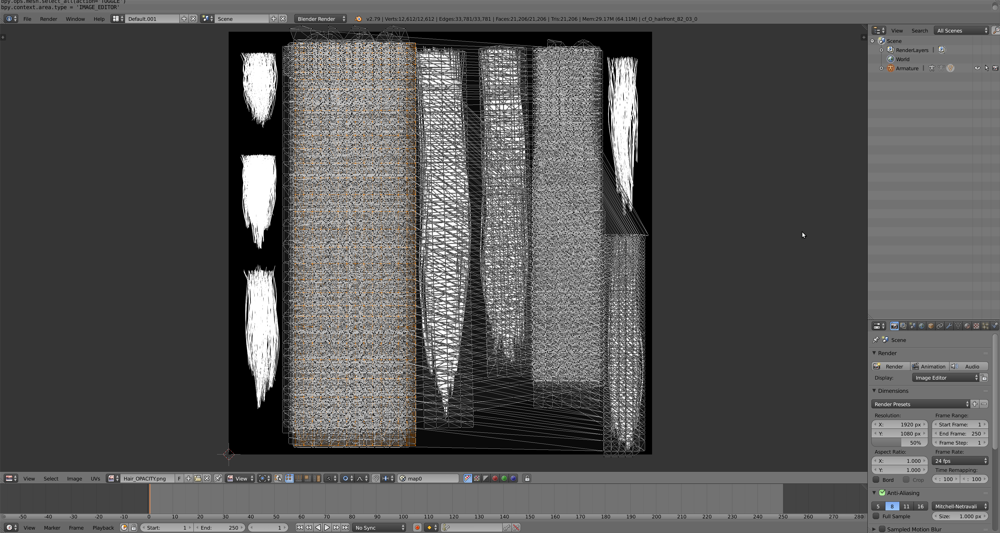
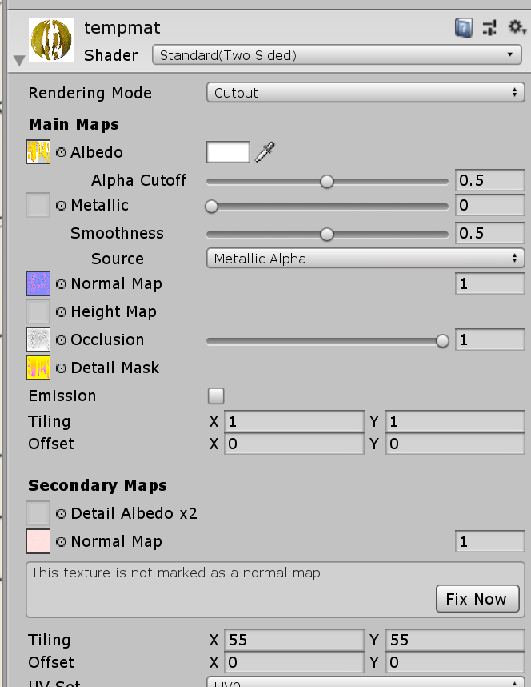
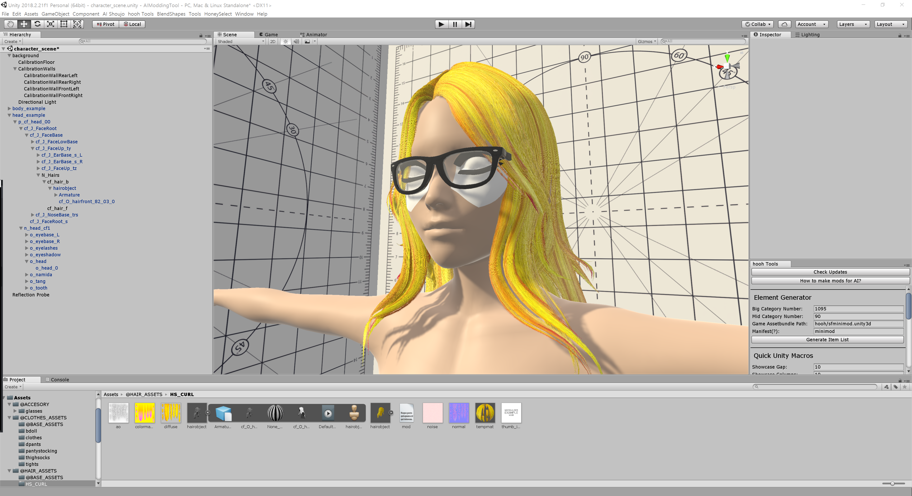

# How to make hairs

don't forget to watch, star and share the repository to not miss further instructions. Idaf about stars but people who want to create new hairs need to watch this so yeah.

## Requirement
- Nice above-average IQ
- basic knowledge of 3D Modeling
- basic knowledge of Unity Engine
- 3D Tools like blender or 3dsmax
- Untiy Editor 2018.2.21f
- Photoshop or GIMP
- [hooh Modding Tool Project](https://github.com/hooh-hooah/ModdingTool)

## Steps

### Prepare Assets


#### Prepared Asset - Rigged Hair



#### Prepared Asset - Properly setup UV for hooh's Hair Texture. (Optional)

After then, prepare some nice mesh to put on. You can use any 3d editing tool. The minimum requirement for the hair object is a bone and a mesh.

If you want to make your hair move then you need to add more then 2 bones. also, the more bone is the more smooth it feels. 

I'm not going to explain the basic of 3D modeling here. you can go Youtube to search some nice infromations about how to use 3D software. You'll need to learn following things: basic mesh editing, culling, basic setup, vertex weighting, rigging.

[!] WARNING [!]

Currently it's in alpha, you're forced to use or make dummy textures to fit requirements to build hair mod.

Hair mod requires 5 essential textures.

1. diffuse

   still figuring out how it's working but Green Channel is Depth and Red Channel is Diffuse and Alpha Channel is Alpha Cutout. (or dither.)

2. normal

   it's a normal map. [just use this flat bumpmap texture if you don't know what to do.](https://docs.unity3d.com/uploads/Main/BumpMapFlatColour.png)

3. noise

   detail normal map that illusion is using to make it looks like some real hairs. [just use this flat bumpmap texture if you don't know what to do.](https://docs.unity3d.com/uploads/Main/BumpMapFlatColour.png)

4. colormask

   colormask for hairs. Red is Main Color, Green is Top Color Blur is Bottom Color. Just make red texture if you don't know what to do.

5. ao

   Ambient Occlusion texture for hair. Just make white texture if you don't know what to do.

Do NOT rename texture's name (you can rename extensions) or it will fail to build!

#### Properly name bones

Please follow the bone naming convention to make tool detect target bones and setup dynamic bones and other stuffs automatically. 

Root bone should be `***_top`, branch bones should be `***_s`.

It will looks like this

```
hair_top
   └ back_s
      └ ... child bones
   └ front_s
      └ ... child bones
   └ side_s
      └ ... child bones
```

### Prepare Scenes


Load Example Scene from `character_scene.unity` and navigate to N_Hairs of head_example.

put your mesh on that N_Hairs.


It will looks like this. Apply material first. I'll make temporal material with then name 'tempmat' and apply the material to the hair mesh.
Remember this name because we're going to include this in `mod.xml`.


The material should include all of textures you're going to use. Setup your temporal material like this 



but do not convert noise.png because it's already a normal map.

After setting up material, you need to adjust your hair. Adjust your hair with Unity Editor or 3D Tool to just make it fit right on the head mesh.



### Add Behavior to your Hair

If you have long hair, it's expected be affected by external force or gravity. there is a lot of way to do it, but I'm using ILLUSION's way - DynamicBones.

DynamicBone is a Unity Asset can be purchased in [here](https://assetstore.unity.com/packages/tools/animation/dynamic-bone-16743). *You can do other things* but I suggest you to purchase the plugin from the asset store for the most stable experience.

Since it's really complicated I suggest you to experiment it with Play Mode first. You can set values in editor and see how they're moving in Play Mode by moving around your root head object.

I suggest you to go some VRChat Dynamic Bone tweaking Tutorial. They have more information than me. I'll more focus on how to add new hairs on the game.


Add your DynamicBone and assign DynamicBone's root to your hair bones. If you don't get how to make it so, check the examples comes with modding tool.


Check if your DynamicBone is working or not in **PLAY MODE**. <u>You cannot check whether it's working or not in Edit Mode</u>

### Initialize Hair with Modding Tool

Click your hair mesh and click Initialize Hair. 


Then Everything will setup automatically. If you can see things like this, it's working so you don't have to worry about it. just make sure of few things like:

1. If RendCheckVisible and RendHair has more than 0 Size?
2. Is your hair object is in layer 'Chara'?

### Register mod.xml

Make your mod.xml. example can be found in [here](https://github.com/hooh-hooah/ModdingTool/blob/master/Assets/%40HAIR_ASSETS/HS_CURL/mod.xml).

Check following list or it will fail to build:

1. Check if every texture's extension is correct.
2. Check if you've included hair material in mod.xml

### Preview your hair before export

Add DevPreviewHair Component to your hair mesh. 


It will allow you to see how it will looks like in the game in **Play Mode**. It will reduce time and effort of checking your mod by launching the game. 


Just make sure everything is there and path is correct.


You can test how texture will affect the shading and what you can do by changing the textures and sliders.

### Build Mod


Specify Zipmod Destination and click build hairs.

Remember, you need to install Bandizip in C: Drive at this moment to pack zipmods. I will change this later.

## FAQ

- Bruh dithering
  
  embrace it or make your own shader you coomer
  
- What the hell? I can only use ONE MATERIAL?

  yes and it's not my fault. blame ILLUSION
  
- Do i have to change shader every sigle fucking time?

  atm, yes. Expect me to make new hair shader replica or you can just keep doing it.

## Troubleshooting

#### Oh noes, my model's normal is god damn fugly

Try "Set Normal" in blender or use Transfer Data to make it really smooth.

#### SB3Utility Fails

- Failed to find external texture

  Please refer all textures in material file that you're packing with.

- Invalid Index

  Your mod.xml is not including all textures.

#### I can't build my mod!

Check [here](https://github.com/hooh-hooah/ModdingTool#trouble-shooting)

#### I can see my mod but it won't load when I click it

This is mostly caused wrong setup of your game object.

1. The hair does not have CmpHair.cs

   You can initialize most of things by clicking Initialize xxxx

2. You forgot something

   Do your clothes scaled properly? Everything should be 1.

   Do your gameobject has skinned mesh renderers?

   Did you included prefab (sometimes you didn't)? 
