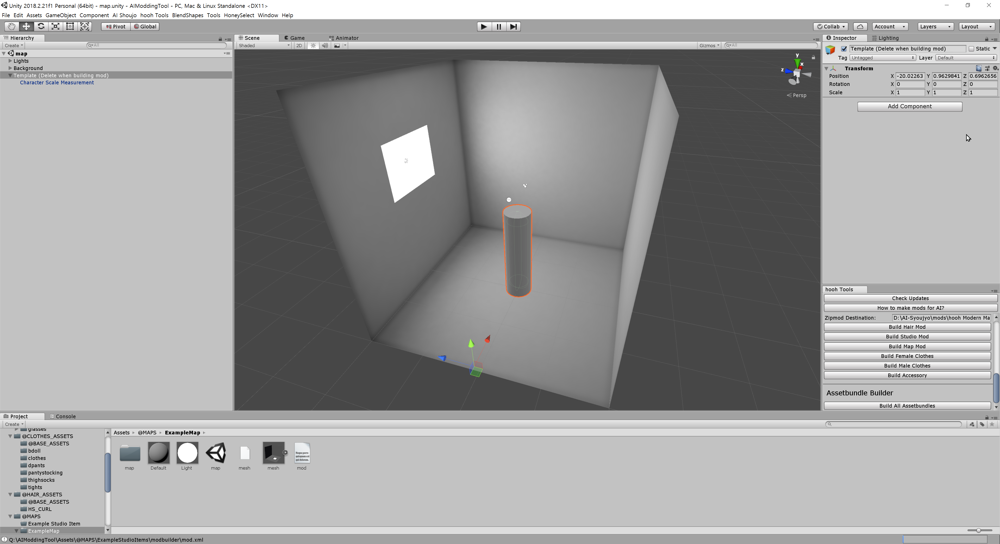

# How to make Map

## Basic Requirement

- Nice above-average IQ
- basic knowledge of 3D Modeling
- basic knowledge of Unity Editor
- 3D Tools like blender or 3dsmax
- Untiy Editor 2018.2.21f
- Photoshop or GIMP
- [hooh Modding Tool Project](https://github.com/hooh-hooah/ModdingTool)

## Steps

### Prepare Scene

##### Add Scale to measure the map's size.

There is `Character Scale Measurement` prefab that helps you to scale your map into AI-shoujo's size. That cylinder is average character size in AI-shoujo.

Most of map will be fine if you scale 9x times larger than original size. but don't forget to scale it properly.

##### (Optional) Place Lights

Since not most of people are not expert of lights so it's good idea to put some lights and make scene static to make look good for everyone.

You can bake lightmaps and reflection probe, light probes to get extra good quality

##### Make Everything in Layer 11 (Map)

Everything should be in Layer 11 to get properly lighted in-game. 

### Save Scene

Save scene like this.

### Make mod.xml

Make your own mod.xml. Here is [example](https://github.com/hooh-hooah/ModdingTool/blob/master/Assets/%40MAPS/ExampleMap/mod.xml)

### Build Mod

Specify Zipmod Destination and click build Map Mod.

Remember, you need to install [Bandizip](https://kr.bandisoft.com/bandizip/) in C: Drive at this moment to pack zipmods. I will change this later.

### Test In-Game

Test your clothes working in-game.

### Trouble Shooting

#### I can't build my mod!

Check [here](https://github.com/hooh-hooah/ModdingTool#trouble-shooting)

#### I can't see my mod.

Check if your id and name is properly named. 

#### I can't see my map!

Check if unity bundle is properly built.

#### My map is kinda weirdly placed.

Place Root Object of Map Position 0,0,0 and Angle 0,0,0 and Scale 1,1,1.

#### Map does not takes any lightings

Check if the map is in Layer 11 (Map)
