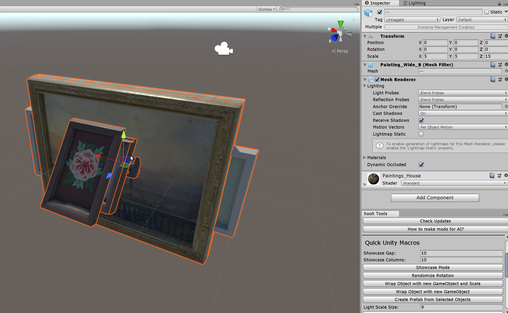
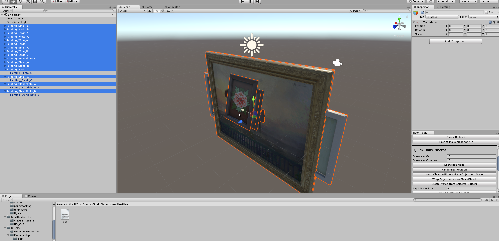
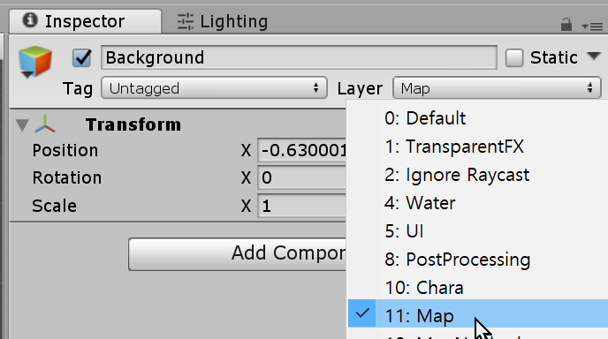

# How to make Studio Mods

## Basic Requirement

- Nice above-average IQ
- basic knowledge of 3D Modeling
- basic knowledge of Unity Editor
- 3D Tools like blender or 3dsmax
- Untiy Editor 2018.2.21f
- Photoshop or GIMP
- [hooh Modding Tool Project](https://github.com/hooh-hooah/ModdingTool)

## Steps

### Prepare GameObjects

##### Put Everything on the scene.

##### Adjust Transform

##### Go to folder to Contain mod.xml 

##### Process GameObject

##### Make Everything in Layer 11 (Map)

Everything should be in Layer 11 to get properly lighted in-game. 

### Register as Prefab

### Make mod.xml

Make your own mod.xml. Here is [example](https://github.com/hooh-hooah/ModdingTool/blob/master/Assets/%40MAPS/ExampleStudioItems/modbuilder/mod.xml)

You can easily generate items and assets list with Element Generator and put them in like an example above.

### Build Mod

Specify Zipmod Destination and click build Studio Mod.

Remember, you need to install [Bandizip](https://kr.bandisoft.com/bandizip/) in C: Drive at this moment to pack zipmods. I will change this later.

### Test In-Game

Test your clothes working in-game.

### Trouble Shooting

#### I can't build my mod!

Check [here](https://github.com/hooh-hooah/ModdingTool#trouble-shooting)

#### I can't see my mod.

Check if your id and name is properly named. or Check [here](https://github.com/hooh-hooah/ModdingTool#trouble-shooting)

#### Items does not takes any lightings

Check if the map is in Layer 11 (Map)

#### I can't color them!

It's normal. I'll give you another instructions soon.